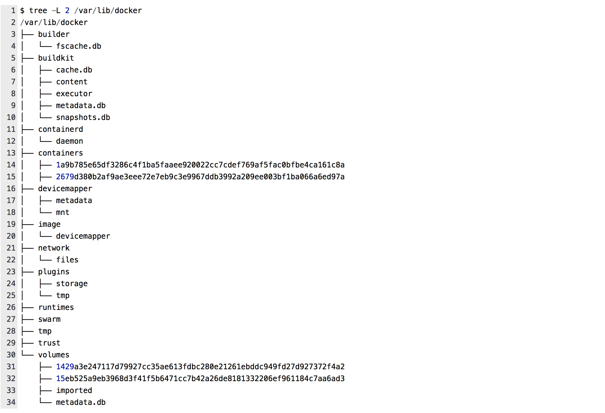

Table of Contents
=================

* [Table of Contents](#table-of-contents)
* [课程出品人](#课程出品人)
* [课程简介](#课程简介)
* [1、docker 容器基础](#1docker-容器基础)
    * [1.1、docker 功能架构](#11docker-功能架构)
    * [1.2、docker 组件介绍](#12docker-组件介绍)
* [2、容器存储管理](#2容器存储管理)
    * [2.1、镜像存储原理](#21镜像存储原理)
    * [2.2、容器存储驱动](#22容器存储驱动)
        * [2.2.1、AUFS](#221aufs)
        * [2.2.2、Device mapper](#222device-mapper)
        * [2.2.3 overlayFS](#223-overlayfs)
        * [2.2.4 如何选择存储驱动](#224-如何选择存储驱动)
        * [2.2.5 存储驱动最佳实践](#225-存储驱动最佳实践)
        * [docker 磁盘划分推荐](#docker-磁盘划分推荐)
        * [docker 存储驱动配置推荐](#docker-存储驱动配置推荐)
            * [Devicemapper 的配置](#devicemapper-的配置)
            * [OverlayFS 的配置](#overlayfs-的配置)
    * [2.3 容器数据卷驱动](#23-容器数据卷驱动)
        * [2.3.1 Volume 理论与实践](#231-volume-理论与实践)
        * [2.3.2 Bind mounts](#232-bind-mounts)
        * [2.3.3 tmpfs](#233-tmpfs)
        * [2.3.4 docker volume 插件](#234-docker-volume-插件)
    * [2.4 容器镜像仓库](#24-容器镜像仓库)
* [3、容器在 Kubernetes 中存储管理](#3容器在-kubernetes-中存储管理)
    * [3.1 无状态应用的容器存储](#31-无状态应用的容器存储)
    * [3.2 有状态应用的容器存储](#32-有状态应用的容器存储)
    * [3.2.3 K8S 中容器存储实践](#323-k8s-中容器存储实践)
        * [3.2.3.1 K8S NFS PV/PVC 基础实践](#3231-k8s-nfs-pvpvc-基础实践)
        * [3.2.3.2 如何关联 PVC 到特定的 PV](#3232-如何关联-pvc-到特定的-pv)
        * [3.2.3.3 K8S开启默认的StroageClass](#3233-k8s开启默认的stroageclass)
        * [3.2.3.4 K8S 中使用 StorageClass](#3234-k8s-中使用-storageclass)
* [4、参考文献](#4参考文献)

# 课程出品人

陈强，目前就职于上汽集团云计算中心，容器云架构师及技术经理；
长年在云计算领域搬砖，曾就职于 Intel, IBM, 爱奇艺 等公司；有五年基于 Docker/Mesos/Kubernetes 的云容器研发经验，积累了丰富的生产实践经验，专注于云原生技术的研究。
2020 容器云职业技能大赛百位专家委员会成员。

# 课程简介

如今的容器生态发展如火如荼，从最开始的以 Docker 为代表的容器技术的出现，到以 Kubernetes 为代表的容器编排技术的一统江湖，其背后都需要对容器数据的控制与存储管理，比如单机容器存储（ docker 镜像及仓库、存储驱动、数据卷等）和容器集群的编排存储（Kubernetes 容器存储接口、存储卷等）。这章节我们就来讲讲容器的存储管理部分，特别是单机容器存储部分，稍带 Kubernetes 编排系统中的存储。单机容器存储，我们将从容器的镜像构成原理讲起，让大家知道容器镜像存储的本质。接着到容器的存储驱动及其最佳实践分享，让大家知道容器存储的管理方式，我们知道数据分为临时的与持久化的，那么了解容器数据层的临时性，进而扩展到容器的外部持久存储，数据卷管理及使用等就非常重要了。最后介绍 Kubernetes 编排系统中容器数据的接入与管理，相信本章节能很好的帮您理解容器存储及其在容器生态中的应用。

---

# 1、docker 容器基础

Docker 容器的基础概念本章节不会介绍，但为了更好理解容器，我们将从 docker 功能架构及其组件讲起，这个希望对刚入门的同学对 docker 存储在容器领域所占的地位有一定了解。

## 1.1、docker 功能架构


从 docker 功能架构图可以看出，docker 提供了很多功能模块，每个模块负责处理相应的请求与响应，通过各个模块的通力协作，完成了容器的管理。下面我以启动一个 busybox 容器为例，来简单介绍各组件所实现的功能：

- 首先，需要制作一个容器镜像。为了方便镜像的管理与存储，它采用联合文件系统的方法对容器镜像进行分层存储与管理，包括 aufs, devicemapper, overlayFS 等存储驱动，对应图中 graphdriver 的调用部分。

- 其次，为了方便已制作镜像的分发，需要将镜像推送到镜像仓库中，通过 apiserver 的方式与 docker registry 进行通讯，对应图中的 image management 部分。

- 然后，启动该镜像，调用 libcontainer 接口来实现容器的创建，利用 Linux 内核的 namespace 和 cgroups 两个重要的功能，实现容器资源的隔离与限制，调用 libnetwork 为该容器提供网络配置，使其拥有独立于主机的网络栈，并基于容器镜像进行读写操作，将临时操作的数据存于容器层。对应图中的 libcontainer, libnetwork 及 linux kernel 部分。

- 最后，如果需要持久容器数据，则需要调用 volumedriver 来实现本地或第三方存储的接入，并将数据写入这些持久卷中。否则，容器停止后，数据连同一起消失。对应图中的 volume 及 local plugin 部分。

## 1.2、docker 组件介绍

**Docker daemon** 是 Docker 的最核心的后台进程，它负责响应来自 Docker client 的请求，然后将这些请求翻译成系统调用完成容器管理操作。该进程会在后台启动一个 API Server，负责接收由 Docker client 发送的请求；接收到的请求将通过 Docker daemon 分发调度，再由具体的函数来执行请求。各功能组件相互配和与协作，组成 Docker 的大脑。

**Docker client** 是一个泛称，可以理解为客户端，用来向 Docker daemon 发起请求，执行相应的容器管理操作。它既可以是我们在控制台输入的 docker command，也可以是任何遵守 Docker API 的客户端。

**Image Management** 由 distribution、layer、image、registry、reference等模块实现（参见上面的 docker 架构图）。

- distribution 负责与 docker registry 进行交互，实现上传、下载镜像以及存储相关的元数据。

- registry 模块负责与 Docker registry 有关的身份验证、镜像查找、镜像验证以及管理 registry mirror 等操作。

- image 模块负责与镜像元数据有关的存储及查找；镜像层的索引及查找；以及镜像 tar 包有关的导入、导出等操作。

- reference 负责存储本地所有镜像的 repository 和 tag 管理，并维护与镜像 hash ID 之间的映射关系。

- layer 模块负责与镜像层和容器层元数据有关的增删改查操作，并负责将镜像层的增删改查操作映射到存储驱动模块，提供容器层使用。

**driver components**：为了实现容器的可扩展性，方便第三方插件接入，docker 定义了各种驱动，提供北向接口。主要包括 容器运行时驱动、volume存储驱动、镜像存储驱动三种：

- exec driver 是对 Linux 的 namespaces、cgroups 等容器运行所需的系统调用进行的二次封装，类似 LXC(linux container)，但是其功能更加全面，通过调用 libcontainer 库实现。

- volume driver 负责 volume 数据卷的增删改查，提供了统一的卷管理驱动接口，Docker 中的默认实现是 local 驱动，就是将文件存储在宿主机的某个目录下，其他的 volume driver 均是通过外部插件实现的，方便第三方存储的使用。

- graph driver 通过将容器镜像层（即 image management 中的 layer 模块)映射成对 graph 驱动维护的目录文件来实现容器的存储，它也是所有与容器镜像相关操作的最终执行者。

# 2、容器存储管理

我在上图中用红色矩形框标示了与容器存储相关的几个重要组成部分，这也是本章节的重点内容，本章节将围绕着这几部分展开来讲述容器的存储管理规范。

- 镜像存储原理
- 容器存储驱动
- 容器数据卷驱动
- 容器镜像仓库

## 2.1、镜像存储原理

镜像是一种轻量级、可执行的独立软件包，用来打包软件运行环境和基于运行环境开发的软件，它包含运行某个软件所需的所有内容，包括程序代码、运行时库、环境变量和配置文件等。


上图是 Docker 官网的容器的存储结构图。包括最上层的容器层和其下面所有的镜像层。通过此图，我来解释一下 docker 的存储原理。docker 存储，也就是用来组织 docker 镜像的物理方式，它是基于联合文件系统（UnionFS）来实现的。它允许文件是存放在不同的层级上面的，具体点说，就是一种分层、轻量级并且高性能的文件系统，它通过对文件系统的修改作为一次提交来实现层层叠加，并将不同目录挂载到同一个虚拟文件下。最终通过一个统一的视图，看到这些层级上面的所有文件。

- 最底层是 bootfs（boot-file system），只读层，它主要包含 bootloader (加载器)和 kernel (内核)，bootloader 用于引导并加载 kernel，Linux 刚启动时会加载 bootfs 文件系统，在 Docker 镜像的最底层是 bootfs，当其运行时， 可使 bootloader 完成对内核的加载到内存中，此时内存的使用权已由 bootfs 转交给了内核，同时系统也会卸载 bootfs。

- 次底层是 Debian/Ubuntu/Centos 等各发行版的基础镜像（base image)，只读层，其本质就是 rootfs（root-file system）。它是在 bootfs 之上，包含的就是典型 Linux 系统中的 /dev、/proc、/bin、/etc 等标准目录和文件。对于一个精简的操作系统，rootfs 可以很小，只需要包括最基本的命令、工具和程序即可，因为底层直接共享了宿主机的内核。由此可见，对于不同的 Linux 发行版，rootfs 基本是一致的，而 rootfs 会有差别，因此不同的发行版可以共用 bootfs。

- 再上一层是一些辅助工具，只读层，方便我们进入容器中执行一些操作，比如安装 vim, emacs 等。注意这层非必须的，这里只是为了方便说明层级关系而举的例子。

- 再上一层是业务代码层，只读层，它一般是存放应用的代码，也可以是应用程序依赖的动态库，静态包等。

- 最上层是一个容器的读写层。对镜像的修改都发生在此层，此时该层可以通过 docker commit 把它变成一个新的镜像顶层。联合加载会把各层文件系统叠加起来，这样最终的文件系统会包含所有底层的文件和目录。

通过这种分层的思想，容器镜像就可以共享镜像层了，这样节省了大量存储空间。例如多个镜像从相同的父镜像构建而来，那么宿主机只需在磁盘上保存一份父镜像，同时内存中也只需加载一份父镜像就可以为所有容器服务了。

## 2.2、容器存储驱动

Docker 主要有两种数据存储形式, 一种是 storage driver (也叫做 graph driver), 另一种是 volume driver。volume driver 是要持久化容器数据卷而提供的，将在下一小节进行分享。这小节来看一下 stroage driver，它主要是在容器中存储那些无状态的数据，也是容器层数据存储的本质。

Docker 镜像的存储，它的底层是基于不同的文件系统实现的，而容器存储驱动也是针对不同的文件系统定制的，比如 AUFS、Btrfs、OverlayFS, Device mapper 还有 ZFS, VFS 等。Docker 公司 为这些文件系统分别开发出了相应的存储驱动，也就是通过这些驱动实现了把容器数据存储在了磁盘上面。

Docker 的存储驱动架构设计成可插拔的，这可以让我们根据自身的环境和使用场景来灵活地选择使用哪一种存储驱动。每个 Docker 存储驱动基于 Linux 文件系统或卷管理器并以其自己独特的方式自由地实现镜像层和容器层的管理。这意味着一些存储驱动在不同的情况下会比其它的驱动要好。一旦我们决定了使用哪种存储驱动，就可以在 Docker daemon  启动时配置使用该类驱动，比如对在 `/etc/docker/daemon.json` 文件中的 `storage-driver` 字段进行设置成 overlay2。Docker daemon 只能运行一种存储驱动，之后所有由 docker daemon 创建的容器都使用同样的存储驱动，所以如果要更换存储驱动，之前驱动中的数据是不能迁移过来的，为了回滚，需要事先对其 backup。

下面介绍各驱动的原理及性能表现，如您还在犹豫选择哪种 docker 存储驱动，就可以参考一下。

### 2.2.1、AUFS

AUFS 是 docker 最早先支持的 storage driver，AUFS 的全称是 Another UnionFS，后改名为 Alternative UnionFS，再后来又改名叫作 Advance UnionFS，它是对 Linux 原生 UnionFS 的重写和改进。由于一直没有进入 Linux 内核，目前只能在 Ubuntu 和 Debian 等发行版中使用。AUFS 这里不做详细展开，早期有过其很多资料介绍。但由于其简单易理解，还是推荐大家了解一下，详见[官方文档](https://docs.docker.com/storage/storagedriver/aufs-driver/)。

我们简单看下 AUFS 性能的优缺点：

- 在容器密度比较高的场景下，AUFS 是非常好的选择，因为 AUFS 的容器间共享镜像层的特性使其磁盘利用率很高，容器的启动时间很短；

- AUFS 中容器之间的共享使其对系统页面缓存的利用率很高；

- 但 AUFS 的写时复制策略会带来很高的性能开销，因为 AUFS 对文件的第一次更改需要将整个文件复制带读写层，当容器层数很多或文件所在目录很深时尤其明显；

### 2.2.2、Device mapper

在 overlay2 没有流行之前，在 RedHat 体系中一直推荐使用 Device mapper，所以这里也稍详细的介绍，具体可参考 [Docker官方的 Device mapper 章节](https://docs.docker.com/storage/storagedriver/device-mapper-driver/) 。Device mapper 在 Linux2.6 内核中被并入内核，它很稳定，也有很好的社区支持。

Device mapper 原理是将所有的镜像和容器存储在它自己的虚拟设备上，这些虚拟设备是一些支持写时复制策略的快照设备。Device mapper 工作在块存储层而非文件系统层上，这意味着它的写时复制策略不需要拷贝整个文件，几乎没有性能开销。

Device mapper 的工作流大概如下：

- 首先，创建一个由 Device mapper 实现的用于存储镜像和容器层的精简配置池（thinpool)。

- 其次，将 thinpool，镜像层及容器层的 metadata 都以 Json 格式存放于 `/var/lib/docker/devicemapper/metadata/` 目录下，当然这些层都是以写时复制方式存放的，一般只有在和父镜像层不同时，才会占用空间。

- 最后，将容器层（即可读写层）挂载在 `/var/lib/docker/devicemapper/mnt/` 下，而镜像层（即只读层）就以空目录存在，不占用空间。

从下面官网这张图也可以看出来，Device mapper 主要基于快照（snapshot) 方式实现了容器镜像的存放。最下面的镜像层是存在于 thin pool 中的 base device 的快照，镜像的每一层都是它下面一层的快照，容器是创建容器的镜像的快照。


下面来看下，device mapper 的性能情况，它主要受**按需分配**策略和**写时复制**策略影响：

- **按需分配(allocate-on-demand)**，device mapper 通过按需分配的策略为需要写入的数据分配数据块。也就是说，当容器中的进程需要向容器写入数据时，它才从资源池中分配一些数据块并将其映射到容器中。当容器频繁进行小数据的写操作时，这种机制非常影响影响性能。另外，一旦数据块被分配给了容器，对它进行的读写操作都是直接对块进行操作。

- **写时复制(copy-on-write)**，它与 AUFS 一样，也支持写时复制策略。容器中第一次更新某个文件时，Device mapper 调用写时复制策略，将数据块从镜像快照中复制到容器快照中。Device mapper 的写时复制策略以 64KB 作为粒度，意味着无论是对 32KB 的文件还是对 1GB 大小的文件的修改都仅复制 64KB 大小的文件。这相对于那些在文件层面进行读操作的存储驱动来说，Devicemapper 具有很明显的性能优势。但是，如果容器频繁对小于 64KB 的文件进行改写，Device mapper 的性能是低于 AUFS 的。

- 存储空间使用效率，Device mapper 不是最有效使用存储空间的 storage driver，启动 N 个相同的容器就复制了 N 份文件在内存中，这对内存的影响很大。所以 Device mapper 并不适合容器密度高的场景。

在没有出现 overlay2 时，我们在生产中也使用了几年的 Device mapper。总的来说，Device mapper 还是不错的，比较喜欢它的一个地方，是可以限制住容器运行时的磁盘大小 ，其他的 docker storage 都不可以。这个对于某些租户由于不正当使用容器，导致其占用的存储空间超过了容器设定的存储配额上限时，只会影响该容器数据的写入，而不会影响到其他容器和主机。但它也有一个比较明显的缺点就是在 docker.service 运行了相当长的时间后，当需要重启它时，可能会由于无法 umount 块设备而导致容器 hang 住，此时只能重启主机来解决该问题。

### 2.2.3 overlayFS

OverlayFS 是一种现代的联合文件系统，与 AUFS 类似，但是速度更快且实现更简单。 Docker 为 OverlayFS 实现了 overlay 和 oerlay2 两种存储驱动，overlay2 相对来说，更新且更稳定。 

目前我们在生产环境中大量使用了 overlay2 ，相对还比较稳定。overlay2 一般会安装在主机的  `/var/lib/docker` 目录下，这个目录其实是一个按 xfs 或 ext4 （不同的驱动采用的不一样）进行格式化了的文件系统，Docker 中管它叫 Backing Filesystem ，也就是存放容器相关数据的地方。我们可以根据不同的存储驱动选择使用不同的 Backing filesystem 。一些存储驱动能在不同的 Backing filesystem 上操作，比如 overlay2 就可以在 xfs 和 ext4 上操作。不过有些存储驱动需要配套使用，例如 Btrfs 存储驱动需要 Btrfs backing filesystem。


如上图所示，OverlayFS 将底层(Lower)目录称为 lowerdir，上层(Upper)目录称为 upperdir，合并层(merged) 就是我们进入容器中看到的文件系统的统一视图层。当需要修改一个文件时，使用写时拷贝技术将文件从只读的 Lower 层复制到可写的 Upper 进行修改，结果也保存在 Upper 层。

- lower 层，也就是镜像层，它是一个只读层。

- upper 层，也就是容器层，它是一个可读可写层。
  - upper 层采用了写实复制的机制，也就是说只有对某些文件需要进行修改的时候才会从 lower 层把这个文件拷贝上来，之后所有的修改操作都会对 upper 层的副本进行修改。
  - 其实与 upperdir 并列的还有一个 workdir，它的作用是充当一个中间层的作用。也就是说，当对 upper 层里面的副本进行修改时，会先放到 workdir，然后再从 workdir 移到 upper 里面去，这个是 overlay 的工作机制。

- merged 层，是一个统一视图层。从 mergedir 里面可以看到 upper 和 lower 中所有数据的整合，然后我们 docker exec 到容器里面，看到一个文件系统其实就是 mergedir 统一视图层。

下图所示，我们以 overlay2 为例，到主机器上看看某一个容器的存储分布情况，可以清晰的看出每个层对应于某个目录，比如文件系统就放在 merged 的目录下，也可以看到上图没有体现出来的 workdir。


下面来看下，overlayFS 的性能情况:

overlay2 和 overlay 驱动程序都比 aufs 和 devicemapper 性能更高。在某些情况下，overlay2 的性能也可能优于 btrfs。但是我们需要注意以下几点：

- **页面缓存**， OverlayFS 支持页面缓存共享，即访问同一文件的多个容器会共享该文件的单个页面缓存条目。这使得 overlay 和 overlay2 驱动程序可以有效地利用缓存，所以适合单台主机上容器密度比较高的场景。

- **复制**，与 AUFS 一样，每当容器第一次写入文件时，OverlayFS 都会执行复制操作。这会增加写入操作的延迟，尤其是对于大文件。但是，一旦文件被复制，对该文件的所有后续写入都会在上层进行，后面就不需要再进行复制操作了。OverlayFS copy_up 操作比使用 AUFS 时的相同操作要快，这是因为 AUFS 比 OverlayFS 支持更多的层，并且如果在许多 AUFS 层中进行搜索，可能会产生更大的延迟。overlay2也支持多层，但是会降低缓存命中的性能。

- **inode 限制**，使用旧版 overlay 存储驱动可能会导致过多的 inode 消耗。在 Docker 主机上存在大量镜像和容器的情况下尤其如此。增加文件系统可用的 inode 数量的唯一方法是对其进行重新格式化。为避免遇到此问题，我们可以使用overlay2。

### 2.2.4 如何选择存储驱动

在实际的使用过程中，我们可能会遇到各种类型的操作系统版本（虽然产线上我们一般推荐使用 centos，因为它比较稳定且精简，版本相对更新也不频繁），所以在选择 docker driver 时，也尽可能的选择 [官方](https://docs.docker.com/storage/storagedriver/select-storage-driver/) 推荐的。如下图所示：


各 docker 存储驱动支持的 backing filesystems （前面提过了，就是 `/var/lib/docker/` 目录所在的文件系统） ，有的必须是同一个存储驱动提供者开发（比如 btrfs, zfs），如下：


### 2.2.5 存储驱动最佳实践

下面来介绍一下在部署 Docker 时，在安装位置及存储配置的最佳实践，也是我们经验总结。一般需要从两方面考虑，一个是磁盘的划分，即 docker 安装在系统中的哪个地方，另外一个是选择合适的存储驱动的配置并对所选配置如何做好优化。

#### docker 磁盘划分推荐

对于磁盘的划分，我们在有两块磁盘的情况下（生产环境推荐），一般需要将 docker 安装在一个独立的磁盘中（其实就是 docker 的 backing system 即 `/var/lib/docker` 目录)，系统盘装在另一个磁盘。条件不允许的情况下，只有一个磁盘（可以在测试环境中使用），那么也需要将系统分区和docker所在分区进行单独划分。两种情况都是为了隔离 docker环境 与操作系统，两块盘是物理隔离，一盘两区是逻辑隔离，主要是为了防止 docker 占用的存储空间影响到操作系统空间，也怕操作系统下日志等大存储的文件影响到docker环境。

下面以 Devicemapper 为例，来说明下 docker 的安装目录，这个主要配置 docker 的 backing system 的目录(`/var/lib/docker`)，也是docker存放镜像、容器、文件等的地方，另外一个是存储驱动的配置方法放下一小节。

现简要介绍docker的 `/var/lib/docker` 下内容。使用 `tree -L 2 /var/lib/docker` 列出两层目录的结构图如下：


我们从各目录名就可以简单猜测出其作用。

- builder：在镜像构建时缓存所存放的目录
- builderkit：在18.09版本开始引入了该工具箱，这样在镜像构建时可以提供一些增强功能，比如：性能，存储管理，功能特性和安全性方面的改进。这个可以在构建时进行开启。
- containerd: docker daemon 所在目录
- containers: 所有在该主机上容器所在的目录
- devicemapper: 存储驱动所在目录，不同的类型，对应该类型文件名
- image: 存放容器镜像所在目录
- network: 网络插件所在目录
- plugins: 存储插件所在目录
- runtimes: 容器运行时所在目录
- swarm: 开启swarm容器编排后，数据会存放该目录
- volumes: 所有挂载卷所在目录

在生产环境推荐使用两块盘，比如：


我们用 `lsblk` 来查看一下磁盘块设备分区情况，sda 是系统盘，sdb 是用于安装 docker 的磁盘，如目录 /var/lib/docker 挂载其上。在使用 devicemapper 时，一般需要格式成 lvm，划分成逻辑卷后，方便扩容与划组使用， 并采用了 `thin pool` 来存放容器镜像层与容器层的数据，所以 `thin pool` 分两部分，tmeta(thinpool metadata) 用于存储镜像的 metedata ，而 tdata(thinpool data) 用于存放镜像各层文件。

下面是一块磁盘进行多个逻辑分区的情况，我们将一块 sba 物理盘，划分成三个逻辑分区，其中将 docker 安装在 sda3 这个逻辑分区上，这样也实现了与操作系统的存储隔离。


#### docker 存储驱动配置推荐

在选择不同的存储驱动时，其配置也有讲究，现主要以主流的 Devicemapper 和 OverlayFS 举例，说明具体配置注意点，其他的请参考网上资料。

##### Devicemapper 的配置

devicemapper 默认使用的是 loop-lvm 模式，这个模式使用 sparse files 来创建供镜像和容器快照使用的 thin pool，这个会在存储资源紧张的情况下容易和操作系统资源发生竞争，进而影响 docker 稳定性。在生产环境不要使用 loop-lvm 模式，官方建议使用 direct-lvm 模式。direct-lvm 模式使用块设备（block devices）来创建 thin pool。其参考配置大概如下，顺便把 docker daemon 涉及的其他主要配置也说明了，注释说明了该参数的使用及用途。

```json
{
     // 设置日志等级
    "log-level": "warn", 
    // 如果开启了，docker daemon 会为容器打上 SELinux 的标签来执行一些安全代码。
    // 并且从文件 /etc/selinux/targeted/contexts/lxc_contexts 读取默认上下文信息来设置容器的上下文，
    // 比如一般使用 svirt_lxc_net_t 来隔离容器到主机，并使用 MCS 标签来阻止一个容器进程攻击其他容器或主机，
    // 保证容器间的安全访问，但这些如果低内核版本支持不好，或者容器的volumes挂载到错误的标签时，就会出错，
    // 还有可能导致 docker.service 启动失败，所以官方推荐关闭。
    "selinux-enabled": false, 
    // 一般私有镜像仓库都会配置在这里，如果怕麻烦，可以允许所有私有镜像仓库的访问，即IP全部打开。
    "insecure-registries": [
        "docker-registry.xxx.com", 
    ],
    "max-concurrent-downloads": 10, // 设置并发下载镜像数
    "max-concurrent-uploads": 10,   // 设置并发上传镜像数
    // 一般在单机环境，需要配置其为默认的 docker0 网桥，但在非单机模式下，比如使用了 Kubernetes 的容器网络，
    // 那么需要注意，docker0 的默认网段（通常是172.17.0.0/16）可能会与 Kubernetes 网络插件的网段相同，这时就需要设置成 none，防止冲突。
    "bridge": "none",
    // 设置日志驱动，如果希望能通过 docker logs 命令查看到容器输出的日志，那么需要配置成 json-file/local/journald 方式，
    // 其他的比如 syslog/fluented/splunk 等就不会输出，此时日志是直接输出到这些第三方日志库中。
    "log-driver": "json-file",
    "log-opts": {
        "max-size": "200m", // 设置 docker 日志 logrotate 阈值
        "max-file": "7" // 设置保留 7 份日志文件总数
    },
    // 设置存储驱动，一般我们将其名字配置在这里，然后配置一下其相应的选项 storage-opts 即可
    "storage-driver": "devicemapper",
    "storage-opts": [
        "dm.basesize=20G", // 每个容器不能超过 20G，按需分配，很有用
        "dm.loopdatasize=1T", // 设置该主机最大可供所有 docker 使用的总容量池
        "dm.loopmetadatasize=10G", // 设置 metadata 磁盘总量
        "dm.thinpooldev=/dev/mapper/docker-thinpool",
        "dm.use_deferred_removal=true", // 防止无意地泄露映射资源信息
        "dm.use_deferred_deletion=true" // 结合上个参数，防止无意地泄露映射资源信息
    ],
    // 如果没有设置此参数，那么在 docker.service 重启时，所有在运行的容器都会终止，所以需要开启，
    // 这样可以不受 docker.service 的影响，这个在 docker 升级版本时，特别有用，保证容器不被杀死。
    "live-restore": true,
    // 在启动容器时，为其设置的执行配置，比如设置cgroup驱动是由systemd管理还是由cgroupfs管理等。
    "exec-opts": [
        "native.cgroupdriver=cgroupfs" // 也可以使用 systemd，k8s 环境下推荐使用 systemd
    ]
}
```

##### OverlayFS 的配置

如果使用 OverlayFS，我们一般使用 overlay2 驱动程序，而不要 overlay，这个主要是因为它在 inode 利用率方面比较高效。overlay2 本身支持多达 128 个较低的 OverlayFS 层。这个功能可以为那些和层相关的命令提供更好的性能，比如 docker build 和 docker commit，并在其 backing system 上消耗更少的 inode。但 overlay2 对操作系统内核版本有一定的要求，它需要 4.0 或以上的内核版本，或使用 3.10.0-514 及更高版本的 RHEL 或 CentOS。
overlay2 在 docker 社区版（Docker EE 17.06.02-ee5 及以上版本）都支持，并是 docker 官方推荐使用的存储驱动。 docker daemon 中使用 overlay2 时的参考配置相对比较简单，和 devicemapper 相同的地方不作过多说明，现在主要注释一些特别的地方，如下：

```json
{
    "log-level": "warn",
    // 关闭 selinux，防止低内核版本中的 overlay2 不支持 selinux 而使 docker 启动失败
    "selinux-enabled": false, 
    // 若允许访问所有私有镜像仓库，就配置全0
    "insecure-registries": ["0.0.0.0/0"], 
    "max-concurrent-downloads": 10,
    "max-concurrent-uploads": 10,
    "log-driver": "json-file",
    "log-opts": {
        "max-size": "200m",
        "max-file": "7"
    },
    "bridge": "none",
    "storage-driver": "overlay2",
    "storage-opts": [
        "overlay2.override_kernel_check=true" //这个开启内核检查
    ],
    "live-restore": true,
    "exec-opts": [
        "native.cgroupdriver=cgroupfs"
    ]
}
```

当不知道我们 docker 使用具体哪个 storage driver 时，我们可以用 `docker info` 来查看。

## 2.3 容器数据卷驱动

默认情况下，我们在容器中创建、删除或修改的文件都会写入到容器层。这意味着：

- 当容器不存在时，容器里面的数据也就不存在了，容器本身不能让这些数据持久化，而且即使容器存在，容器外的其他进程想要访问该容器里面的数据也是比较困难的。

- 容器层数据和其所在的宿主机是强耦合的，不方便迁移到其他主机。

- 容器层的数据都是通过容器的存储驱动来管理文件系统的，它通过使用联合文件系统来使用 Linux 内核，这层额外的封装，在性能方面，会比利用**数据卷**来直接写文件到宿主机要差一些。

因此，为了解决上面的几个问题，docker 提供了几种方式来存储文件到宿主机层面。典型的有 数据卷（data volumes) 和绑定挂载 (bind mounts)。还提供了一些与操作系统相关的数据持久存储方式，比如在 Linux 中可以使用 tmpfs 来实现数据的存储，当然这个是存放在内存中的，但这个性能要比存放到容器的可读写层要好。还提供了针对 windows 中使用的 named pipes 。

所以根据数据卷挂载类型来分，可以分成 volume, bind mounts, tmpfs, named pipes 这几种，接下来分别来介绍。


从这个图可以看出，主要区别就在于容器在持久化数据所采用的挂载方式的不同：

- Volumes（数据卷）是以主机文件系统的一部分存放的，它由 Docker 来管理，比如 Linux 系统下是在 `/var/lib/docker/volumes/` 这个目录下。非 docker 进程不可以更改存放的这部分数据。Volumes 是官方推荐使用的持久化数据最好的方法。

- Bind mounts (绑定挂载）可以存储在宿主机上的任何位置。它们甚至可能是重要的系统文件或目录。宿主机上的非 Docker 进程或 docker 容器皆可随时对其修改。这种可操作的权限太大了，控制不好就存在一定的安全隐患。

- tmpfs mounts，只可以存放在宿主机的内存中，临时的，数据自然不会写入到宿主机的文件系统中，但还是要比写在容器层要好。

不管采用哪种挂载方式，在容器看来，数据都是一样的，他们在容器的文件系统中呈现出来的要么是单个文件，要么是目录。所以要做的就是根据实际应用场景选择不同的挂载方式来实现数据的持久化，这个非常重要。

### 2.3.1 Volume 理论与实践

Volume 是官方推荐的使用方式，它不像 Bind mounts 那样在主机上是一个个独立的目录，但 Volume 是被 Docker 所管理的，Docker 会为 Volume 在主机上创建一个 `/var/lib/docker/volumes` 目录，并管理该目录中的文件内容，也就是如果没有安装 Docker 是不可能使用 Volume 的。与 Bind mounts 相比，有如下优点：

- 卷更易于备份或迁移
- 我们可以使用 Docker CLI 命令或 Docker API 来管理卷
- 卷在 Linux 和 Windows 容器上均可使用
- 可以在多个容器之间更安全地共享卷
- 卷驱动程序可以使我们将卷存储在远程主机或云提供商上，用于加密卷的内容或添加一些其他的功能
- 新的卷也可以通过其他卷容器来做预处理

Docker 为 Volume 提供了很多控制命令，比如创建和管理卷：

```bash
# 创建名字为 my-vol 的卷
$ docker volume create my-vol
# 列出创建的卷
$ docker volume ls
local               my-vol
# 详细查看卷
$ docker volume inspect my-vol
[
    {
        "Driver": "local",
        "Labels": {},
        "Mountpoint": "/var/lib/docker/volumes/my-vol/_data",
        "Name": "my-vol",
        "Options": {},
        "Scope": "local"
    }
]
# 删除卷
$ docker volume rm my-vol
```

比如运行一个需要挂载卷的容器，将 myvol2 挂载到容器的 /app 目录下面并是只读的，则可以使用两种方式 `--mount`  和 `-v` 来创建，下面效果是一样的。

```bash
# 使用 --mount 方式启动一个容器
$ docker run -d \
  --name devtest \
  --mount source=myvol2,target=/app,readonly \
  nginx:latest

# 使用 -v 方式
$ docker run -d \
  --name devtest \
  -v myvol2:/app:ro \
  nginx:latest
```

在容器停止或删除后，数据都会一直在卷中，那如何删除一个特定的卷呢？先停止使用它的容器，这时会触发卸载卷的操作，然后才可以删除该卷。

```bash
# 停止使用它的容器
$ docker container stop devtest
# 删除该容器
$ docker container rm devtest
# 删除卷
$ docker volume rm myvol2
```

还有一个 `docker volume prune` 会删除未装入到某个容器或者服务的所有卷，所以需要谨慎使用。

上面这些操作都是 Docker 提供的功能，所以在非 docker 环境下无法使用。

还有一种匿名数据卷，其实和命名数据卷的实现是一致的，区别是匿名数据卷的名字为随机码。

```bash
# 匿名数据卷，它会在主机上默认创建目录：/var/lib/docker/volumes/{volume-id}/_data 进行映射
$ docker run –d -v /data nginx:latest；
# 命名数据卷，如果当前找不到 myvol3 卷，会创建一个默认类型（local）的卷。
$ docker run –d -v myvol3:/data nginx；
```

### 2.3.2 Bind mounts

Bind mounts 是早期 Docker 为容器提供的外存数据功能，它相比 Volumes 来说，提供的功能少些，它需要使用主机的上的绝对路径。在使用 Bind mounts 时，不需要提前为容器需要使用的外挂存储在主机上创建好文件或目录，它可以自动创建。另外，容器可以修改挂载目录下的任何文件，使应用更具有便捷性，但也带来了安全隐患。

使用方式如下：

- 以 `-v: src:dst:opts` 的格式，和 Volumes 一样
- src：表示主机上的源目录或文件，需要是绝对地址；
- dst：表示需要挂载到容器里的哪个目标目录；
- opts：可选，挂载属性有很多，比如：ro, consistent, delegated, cached, z, Z；
其中 consistent, delegated, cached 为 mac 系统配置共享传播属性；Z、z：用于配置主机目录的 selinux label

比如下面我们还是以两种方式来将当前目录下的 target 目录映射到容器中的 /data 下面，

```bash
$ docker run -d --name devtest -v "$(pwd)"/target:/data:ro,rslave nginx:latest
$ docker run -d --name devtest --mount type=bind,source="$(pwd)"/target,target=/data,readonly,bind-propagation=rslave nginx:latest
$ docker run -d --name devtest -v "$(pwd)"/target:/data:z nginx:latest
```

我们还可以设定 bind-propagation 参数，用于控制绑定时的数据传播方向。

```bash
# 主机 /"$(pwd)"/target 下面挂载的目录，在容器 /data 下面可用，反之也可用；
$ docker run –d -v /"$(pwd)"/target:/data:shared nginx
# 主机 /"$(pwd)"/target 下面挂载的目录，在容器 /data 下面可用，反之不可用；
$ docker run –d -v /"$(pwd)"/target:/data:slave nginx
```

具体可选参数说明如下：


如果主机上没有 `/test` 目录，则默认创建此目录，比如：`docker run -d -v /test:/data nginx`。

我们还需要注意，`Bind mounts` 会覆盖容器中的文件，而 `
Volume mounts` 则不会，即如果容器中已有文件，则会将文件同步到主机的目录上。

### 2.3.3 tmpfs

tmpfs 是非持久化的卷类型，存储在内存中，数据就易丢失了。但如果容器要生成非持久状态的数据，请考虑使用 tmpfs 挂载来避免写入容器的可写层来提高容器的性能。
启动一个使用了 tmpfs 容器有两种方式，一种是通过  `--mount` 的方式，一种是直接使用 `--tmpfs`，如下所示：

```bash
# 使用 --mount 方式
$ docker run -d \
  -it \
  --name tmptest \
  --mount type=tmpfs,destination=/app \
  nginx:latest
# 使用 --tmpfs 方式
$ docker run -d \
  -it \
  --name tmptest \
  --tmpfs /app \
  nginx:latest
```

其中 `--mount` 方式还提供了两个特殊的可选的控制参数： `--tmpfs-size` （用于控制挂载的 tmpfs 的字节总数，默认是不限制的）和 `--tmpfs-mode`（以八进制表示的文件模式，默认是 `1777` 或 `world-writable`）。示例如下：

```bash
# 设置成了 1770，而非默认的 world-writable
docker run -d \
  -it \
  --name tmptest \
  --mount type=tmpfs,destination=/app,tmpfs-mode=1770 \
  nginx:latest
```

### 2.3.4 docker volume 插件

Docker 也提供了 docker volume 插件的 API 接口，供第三方开发者提供自己的存储卷需要，比如 `/VolumeDriver.Create` 用于卷驱动来创建一个卷，`/VolumeDriver.Remove` 用于删除，`/VolumeDriver.Mount` 用于挂载等等，具体见[官方的 Docker volume plugins](https://docs.docker.com/engine/extend/plugins_volume/)。
下面以 sshFS 为例，这个第三方卷插件可以提供以密码或密钥方式访问远程主机上的卷。下面通过 [vieux/sshfs](https://github.com/vieux/docker-volume-sshfs) 来实现跨主机的 volume 使用。

```bash
# 安装vieux/sshfs插件
$ docker plugin install --grant-all-permissions vieux/sshfs
# 建立 ssh volume
$ docker volume create --driver vieux/sshfs \
  -o sshcmd=<user@host:path>:/home/test \
  -o password=<password> \
  sshvolume
# 使用 ssh volume，如果两主机之间已设定 ssh key 验证，则可以不使用 opt=password 指定密码
docker run -d \
  --name sshfs-container \
  --volume-driver vieux/sshfs \
  --mount src=sshvolume,target=/app,volume-opt=sshcmd=<user@host:path>:/home/test,volume-opt=password=<password> \
  nginx:latest
```

## 2.4 容器镜像仓库

存储镜像的地方，可分成公共及私有的镜像仓库。镜像在被构建完成后，可以在当前宿主上运行，但是如果需要在其它服务器上、公司内部、或者互联网中方便的使用这个镜像，就需要一个集中的地方进行存储与分发镜像，镜像仓库为此而生。制作镜像的 maintainer 可以将其推送到镜像仓库，使用者可以从该库中下载。公有的比如 Docker Hub 和 Quay.io 是两个非常大的镜像仓库。我们为了实现公司内部的快速共享镜像，特别是用于 CI/CD 的场景，就需要私建 docker registry。这里不做具体展开，具体可参考网上资料。

# 3、容器在 Kubernetes 中存储管理

Kubernetes(k8s) 是目前非常火热的容器编排系统，在这个系统中，编排的最小逻辑单元是 Pod，而非容器，所以我们通常在 k8s 中，谈到容器的存储，一般是指 Pod （可以包括多个容器） 的存储。当然其底层还是一个个容器，控制存储对像还是一个个挂载卷，所以这个小节我们简单介绍一下容器在 Kubernetes 中存储管理，K8S 具体概念、使用等在这时不做过多介绍，请参考相关资料。

主要包括下面两方面内容：

- 无状态应用的容器存储
- 有状态应用的容器存储

## 3.1 无状态应用的容器存储

无状态应用一般不需要使用持久的存储，而是使用本地的存储，当然只局限于 Pod 所在的节点上数据是持久保存的，如果 Pod 所发生了飘移跑到了其他节点上，数据就不存在了。比如 HostPath、emptyDir 等。这种使用方式非常方便，比较适用于那种可以自己实现数据一致性的应用来使用，比如 zookeeper， etcd 等，因为他们自己会有一套数据存储协议来保持数据的同步与组件高可用性，有自己的选举机制，当所在的节点宕机时，还能保证应用及其数据的正常使用。
比如下面这个使用 emptyDir 的例子：

```yaml
apiVersion: v1
kind: Pod
metadata:
  name: test-pod
spec:
  containers:
  - image: busybox
    name: test-emptydir
    command: [ "sleep", "3600" ]
    volumeMounts:
    - mountPath: /data
      name: data-volume
  volumes:
  - name: data-volume
    emptyDir: {}
```

## 3.2 有状态应用的容器存储

这部分是 k8s 容器编排中对于容器存储来说比较重要的，这部分涉及到的是有状态应用的持久存储，主要通过 PVC、PV 或者 StorageClass 来管理存储的申请、分配与使用。有状态应用有两个层面的意思，一种是应用的数据需要持久存储，比较数据库等，另外一种是指这些应用之间的拓扑状态，主从等，比如 mysql 集群在 K8S 中就是典型的有状态应用，这种一般是以 StatefulSet 方式呈现，当然还可以是更高级的 Operator 来实现。

PVC(PersistentVolumeClaim) 即存储声明，类似于我们编程中向系统申请内存。它在 K8S 中是一种抽象的存储卷类型，代表了某个具体类型存储的数据卷表达。其设计意图是使存储与应用编排分离，将存储细节抽象出来并实现存储的编排（存储卷）。这样 K8S 中存储卷对象独立于应用编排而单独存在，在编排层面使应用和存储解耦。

PV（PersistentVolume）即持久化存储卷，类似于我们编程中的一块可以使用的内存，只不过这个内存是由管理员手动分配的，在满足一定情况时，Volume Manager 会将其和某个PVC 进行绑定，之后使用 PVC 进行声明了的某个 Pod 中的容器就可以使用这个 PV 用于数据的持久存储了。PV 在 K8S 中代表一个具体存储类型的卷，其对象中定义了具体存储类型和卷参数。即目标存储服务所有相关的信息都保存在 PV 中，K8S 引用 PV 中的存储信息执行挂载操作。直接用 PV 这个资源声明式来创建 PV 类型的存储对像，由于它需要存储管理员事先手动创建好，所以在目前的存储管理中使用的并不多，这里也不过多介绍。

StorageClass 为存储类，表示为一个创建 PV 存储卷的模板。这个在 PVC 创建的时候，K8S 会根据 StorageClass 中定义的某种名为 Provisioner (某种CSI 插件的名字） 组件来处理所有的创建、删除卷等操作，并这个过程是自动进行的，会自动触发创建相应大小及所需访问权限的 PV。其内容包括：目标 Provisioner 名字，创建 PV 的详细参数，回收模式等配置。如下所示：

```yaml
apiVersion: storage.k8s.io/v1
kind: StorageClass
metadata:
    name: csi-rbd
provisioner: rbd.csi.ceph.com
parameters:
    # Comma separated list of Ceph monitors
    # if using FQDN, make sure csi plugin's dns policy is appropriate.
    monitors: mon1:port,mon2:port,...
    # OR,
    # String representing a Ceph cluster to provision storage from.
    # Should be unique across all Ceph clusters in use for provisioning,
    # cannot be greater than 36 bytes in length, and should remain immutable for
    # the lifetime of the StorageClass in use.
    # If using clusterID, ensure to create a secret, as in
    # template-ceph-cluster-ID-secret.yaml, to accompany the string chosen to
    # represent the Ceph cluster in clusterID
    # clusterID: <cluster-id>
    # OR,
    # if "monitors" parameter is not set, driver to get monitors from same
    # secret as admin/user credentials. "monValueFromSecret" provides the
    # key in the secret whose value is the mons
    # monValueFromSecret: "monitors"

    # Ceph pool into which the RBD image shall be created
    pool: rbd

    # RBD image format. Defaults to "2".
    imageFormat: "2"

    # RBD image features. Available for imageFormat: "2"
    # CSI RBD currently supports only `layering` feature.
    imageFeatures: layering

    # The secrets have to contain Ceph admin credentials.
    # NOTE: If using "clusterID" instead of "monitors" above, the following
    # secrets MAY be added to the ceph-cluster-<cluster-id> secret and skipped
    # here
    csi.storage.k8s.io/provisioner-secret-name: csi-rbd-secret
    csi.storage.k8s.io/provisioner-secret-namespace: default
    csi.storage.k8s.io/node-publish-secret-name: csi-rbd-secret
    csi.storage.k8s.io/node-publish-secret-namespace: default

    # Ceph users for operating RBD
    # NOTE: If using "clusterID" instead of "monitors" above, the following
    # IDs MAY be added to the ceph-cluster-<cluster-id> secret and skipped
    # here
    adminid: admin
    userid: kubernetes
    # uncomment the following to use rbd-nbd as mounter on supported nodes
    # mounter: rbd-nbd
reclaimPolicy: Delete
```

**Kubernetes 又是如何知道一个 CSI 插件的名字的呢？** K8S 是通过调用 CSI Identity 服务来获取的。在 `CSI Identity` 这个服务中，最重要的接口是 GetPluginInfo，它返回的就是这个插件的名字和版本
号，比如上图中的 `rbd.csi.ceph.com`。

**然后是如何实现动态创建卷并自动挂载到磁盘的呢？** K8S 是通过调用 `CSI Controller` 服务，它主要实现的就是 Volume Manager 流程中的 `Provision` 和 `Attach` 阶段。Provision 阶段对应的接口是 `CreateVolume` 和 `DeleteVolume`，它们的调用者是 External Provisoner。而 Attach 阶段对应的接口是 `ControllerPublishVolume` 和 `ControllerUnpublishVolume`，它们的调用者是 External Attacher。而不管是 External Provisoner 还是 External Attacher ，他们都会以 watch 机制来监听这些 API 对象的变化（创建、删除、发布、卸载等），来实现自动化管理。这些对象的生命周期，正是由 AttachDetachController 负责管理的，它负责不断检查 Pod 所对应的 PV，及在其所绑定的宿主机上的挂载情况，来决定是否需要对这个 PV 进行 Attach（或者 Dettach）操作。

**最后如何将卷挂载到 Pod 所在的容器中呢？** 其实这就是 Mount 阶段。K8S 是通过调用`CSI Node` 中的 NodeStageVolume 和
NodePublishVolume 两个接口共同实现的。这两个接口实现了卷挂载到了容器中。

最后总结一下，总的过程就是通过 Provision、Attach 和 Mount 三个阶段来实现 CSI 的自动化管理创建、删除、管理卷及挂载、卸载容器存储的。其中 Provision 等价于“创建磁盘”，Attach 等价
于“挂载磁盘到宿主机”，Mount 等价于“将该磁盘格式化后，挂载在卷所在的宿主机目录上”。其实也有一个类似于 CSI 的第三方管理容器存储的方式，那就是 FlexVolume，它只需要实现前两个阶段即可。

## 3.2.3 K8S 中容器存储实践

这小节中我将分享一些容器存储在 K8S 中的一些实践，这里注重一些特殊的使用场景，希望能起到抛砖引玉的效果。

### 3.2.3.1 K8S NFS PV/PVC 基础实践

这里我们为了说明 PV/PVC 相关的使用，以最简单的 NFS 为例来演示，NFS 作为 K8S 的网络存储卷，可以满足持久存储业务的需求，支持多节点读也写。
下面采用 K8S PV 与 PVC 来配套使用 nfs 资源。

创建名字为 nfs-pv 的 PV，假设 yaml 命名为 nfs-pv.yaml 如下：

```yaml
apiVersion: v1
kind: PersistentVolume
metadata:
  name: nfs-pv
  namespace: chenqiang-pv-test
spec:
  capacity:
    storage: 100Mi
  accessModes:
    - ReadWriteMany
  nfs:
    # FIXME: use the right IP
    server: 10.130.44.20
    path: "/test/mysql-nfs01"
```

**解释说明：** nfs 用于指定我们提前搭建好的 nfs server 地址与路径。指定分配的存储卷大小为 100Mi，并指定 `ReadWriteMany`（RWX， 即多主机读写）访问模式，这样该存储卷就可以被部署在多台主机上的容器同时实现存储的共享，并可以同时读与写。类似的还有 `ReadWriteOnce` (RWO，即单主机读写)， `ReadOnlyMany` (ROX，即多主机只读)。这三种方式都是针对节点级别的，也就是说，对于一个 Persistent Volume, 如果是 RWO, 那么只能被挂载在某一个 Kubernetes 的工作节点上，当再次尝试在其他节点挂载的时候，系统会报 Multi-Attach 的错误。如果是 RMX， 那么可以同时在多个节点上挂载并被不同的Pod使用。

接下来，我们创建名字为 nfs-pvc 的 PVC, 假设 yaml 命名为 nfs-pvc.yaml 如下：

```yaml
apiVersion: v1
kind: PersistentVolumeClaim
metadata:
  name: nfs-pvc
  namespace: chenqiang-pv-test
spec:
  accessModes:
    - ReadWriteMany
  storageClassName: ""
  resources:
    requests:
      storage: 90Mi
```

我们来看下此 pod 是否正确运行起来：

```bash
$ kubectl apply -f nfs-pv.yaml 
persistentvolume "nfs-pv" created
$ kubectl apply -f nfs-pvc.yaml 
persistentvolumeclaim "nfs-pvc" created
```

创建使用该 PV 的 pod，只需要在其中用 persistentVolumeClaim 指定。

```yaml
      containers:
      - name: nginx-hello
        image: qzschen/nginx-hello
        ports:
        - containerPort: 80
        securityContext:
          privileged: true
        volumeMounts:
        # name must match the volume name below
        - name: nfs
          mountPath: "/chenqiang/pv-test"
      volumes:
      - name: nfs
        persistentVolumeClaim:
          claimName: nfs-pvc
```

通过 `kubectl apply` 该 pod 后，如下即可正常运行起来了。

```bash
$ kubectl -n chenqiang-pv-test get po
NAME                                      READY     STATUS              RESTARTS   AGE
nginx-hello-deployment-6f9f4d7bcc-86kb5   1/1       Running             0          1h
```

现在我们在不同的 namespace 下来看下刚创建好的 PV 及 PVC。

```bash
# PV 没有 namespace 的概念，是全局可见的，非 namespace 可见，即使此处使用默认的 default namespace 也能看到 chenqiang-pv-test 这个 namespace 下创建的 PV
$ kubectl get pv
NAME            CAPACITY   ACCESS MODES   RECLAIM POLICY   STATUS    CLAIM                       STORAGECLASS   REASON    AGE
nfs-pv          100Mi      RWX            Retain           Bound     chenqiang-pv-test/nfs-pvc                            12m

# PVC 有 namespace 的概念，非全局可见，所以在 default namespace 下是看不到 chenqiang-pv-test 这个 namespace 中创建的 PVC，只能看到本 default namespace 下的
$ kubectl get pvc
NAME             STATUS    VOLUME          CAPACITY   ACCESS MODES   STORAGECLASS   AGE
nfs-server-pvc   Bound     nfs-server-pv   100Gi      RWX                           2h

# 指定了特定的 chenqiang-pv-test namespace 后，可见其下创建的 PVC
$ kubectl -n chenqiang-pv-test get pvc
NAME      STATUS    VOLUME    CAPACITY   ACCESS MODES   STORAGECLASS   AGE
nfs-pvc   Bound     nfs-pv    100Mi      RWX                           12m

# 查看 PV 时，不管指不指定 namespace，都能看到特定 namespace 下的 PV
$ kubectl -n chenqiang-pv-test get pv
NAME            CAPACITY   ACCESS MODES   RECLAIM POLICY   STATUS    CLAIM                       STORAGECLASS   REASON    AGE
nfs-pv          100Mi      RWX            Retain           Bound     chenqiang-pv-test/nfs-pvc                            12m
```

**总结**： PV 是没有 `namespace` 的概念，也就没有租户的概念，但 PVC 有租户的概念，当需要在某个 namespace 下使用 PVC 时，需要指定该 PVC 所属 namespace。这个我们可以通过上面的演示看出。

如果在创建 Pod 的时，没有先创建 PVC，那么为出现如下的 event log:

```bash
Events:
  Type     Reason                 Age               From                  Message
  ----     ------                 ----              ----                  -------
  Warning  FailedMount            58m (x4 over 1h)  kubelet, 10.130.33.8  Unable to mount volumes for pod "nginx-hello-deployment-6f9f4d7bcc-86kb5_chenqiang-pv-test(7b18c376-7382-11e8-9a03-74eacb756039)": timeout expired waiting for volumes to attach/mount for pod "chenqiang-pv-test"/"nginx-hello-deployment-6f9f4d7bcc-86kb5". list of unattached/unmounted volumes=[nfs]
```

当 PVC 创建好后，继续查看 log 如下：

```bash
Events:
  Type     Reason                 Age               From                  Message
  ----     ------                 ----              ----                  -------
  Warning  FailedMount            58m (x4 over 1h)  kubelet, 10.130.33.8  Unable to mount volumes for pod "nginx-hello-deployment-6f9f4d7bcc-86kb5_chenqiang-pv-test(7b18c376-7382-11e8-9a03-74eacb756039)": timeout expired waiting for volumes to attach/mount for pod "chenqiang-pv-test"/"nginx-hello-deployment-6f9f4d7bcc-86kb5". list of unattached/unmounted volumes=[nfs]
  Normal   SuccessfulMountVolume  58m               kubelet, 10.130.33.8  MountVolume.SetUp succeeded for volume "nfs-pv"
  Normal   Pulled                 58m               kubelet, 10.130.33.8  Container image "docker-registry.saicstack.com/chenqiang/nginx-hello:v2.0" already present on machine
  Normal   Created                58m               kubelet, 10.130.33.8  Created container
  Normal   Started                58m               kubelet, 10.130.33.8  Started container
```

当希望创建 2 个 Pod 的时候，会发现有一个启动不了。

```bash
-[appuser@chenqiang-dev pvtest]$ kubectl -n chenqiang-pv-test get po -o wide
NAME                                      READY     STATUS              RESTARTS   AGE       IP               NODE
nginx-hello-deployment-6f9f4d7bcc-86kb5   1/1       Running             0          1h        172.12.180.144   10.130.33.8
nginx-hello-deployment-6f9f4d7bcc-lbt2n   0/1       ContainerCreating   0          1h        <none>           10.130.33.13
```

查看该 pod event log:

```bash
Events:
  Type     Reason       Age                From                   Message
  ----     ------       ----               ----                   -------
  Warning  FailedMount  6m (x25 over 1h)   kubelet, 10.130.33.13  Unable to mount volumes for pod "nginx-hello-deployment-6f9f4d7bcc-lbt2n_chenqiang-pv-test(7b0fcbd3-7382-11e8-80b5-74eacb7559f1)": timeout expired waiting for volumes to attach/mount for pod "chenqiang-pv-test"/"nginx-hello-deployment-6f9f4d7bcc-lbt2n". list of unattached/unmounted volumes=[nfs]
  Warning  FailedMount  12s (x39 over 1h)  kubelet, 10.130.33.13  (combined from similar events): MountVolume.SetUp failed for volume "nfs-pv" : mount failed: exit status 32
Mounting command: systemd-run
Mounting arguments: --description=Kubernetes transient mount for /var/lib/kubelet/pods/7b0fcbd3-7382-11e8-80b5-74eacb7559f1/volumes/kubernetes.io~nfs/nfs-pv --scope -- mount -t nfs 10.130.44.20:/test/mysql-nfs01 /var/lib/kubelet/pods/7b0fcbd3-7382-11e8-80b5-74eacb7559f1/volumes/kubernetes.io~nfs/nfs-pv
Output: Running scope as unit run-11918.scope.
mount: wrong fs type, bad option, bad superblock on 10.130.44.20:/test/mysql-nfs01,
       missing codepage or helper program, or other error
       (for several filesystems (e.g. nfs, cifs) you might
       need a /sbin/mount.<type> helper program)

       In some cases useful info is found in syslog - try
       dmesg | tail or so.
```

根据错误提示，查看`/sbin/mount.<type>`文件，果然发现没有`/sbin/mount.nfs`的文件，安装 `nfs-utils` 即可

解决办法：

`apt-get install nfs-common`

或者

`yum install nfs-utils`

安装之后，/sbin/ 下面多了几个 mount 文件，比如 `mount.nfs` 和 `mount.nfs4`等：

```bash
[appuser@chenqiang-dev]# cat /sbin/mo
modinfo     modprobe    mount.ceph  mount.nfs   mount.nfs4  mountstats 
```

再次 kubectl get po 试下，发现起来了：

```bash
-[appuser@chenqiang-dev pvtest]$ kubectl -n chenqiang-pv-test get po -o wide
NAME                                      READY     STATUS    RESTARTS   AGE       IP               NODE
nginx-hello-deployment-6f9f4d7bcc-86kb5   1/1       Running   0          1h        172.12.180.144   10.130.33.8
nginx-hello-deployment-6f9f4d7bcc-lbt2n   1/1       Running   0          1h        172.12.232.103   10.130.33.13
```

接下来测试一下如何同时写：
分别进入这两个pod，并分别执行如下程序。

在 pod `nginx-hello-deployment-6f9f4d7bcc-86kb5` 中执行：

```bash
sh-4.1# for i in `seq 1 1000`; do echo $i >> a.test; done
```

在 pod `nginx-hello-deployment-6f9f4d7bcc-lbt2n` 中执行：

```bash
sh-4.1# for i in `seq 1000 10000`; do echo $i >> a.test; done
```

经过一段的同时写后，截取部分结果如下：

```bash
995
855
997
998
999
1000
1001
1002
1003
1004
1005
```

我们发现，两个pod在同时开始写的时候，是有一个先后顺序的，比如第一个是从 1写到999，等第一个写完了，第二个再从 1000 写到 9999 这是加了文件锁的缘故。
如果不加任何延时，由于写的太快，中途可能会丢失数据，需要加些延时处理，比如：
另测试一组再次验证：

pod 1 中执行：

```bash
for i in `seq 1 1000`; do echo $i >> a.test; sleep 1; done
```

pod 2 中执行：

```bash
for i in `seq 20001 21000`; do echo $i >> a.test; sleep 1; done
```

先敲下 pod2 中的命令，然后立马敲下 pod1 中的命令，发现会错开写，部分结果如下：

```bash
20001
20002
20003
1
20004
2
20005
3
20006
4
20007
5
20008
6
20009
7
20010
8
20011
9
20012
10
```

### 3.2.3.2 如何关联 PVC 到特定的 PV

早期我们没有 StorageClass 出现时，当手动分配了 PV 卷后，我们很多时候希望将特定的 PVC 绑定到指定的 PV 上，那我们可以使用对 PV 打 label 的方式来实现，具体如下：

1、以 nfs 网络持久存储为例，我们先创建名字为 `nfs-pv1` 的 PV，指定 label，比如这里的 `pv: nfs-pv1`。

```bash
$ cat nfs-pv1.yaml 
apiVersion: v1
kind: PersistentVolume
metadata:
  name: nfs-pv1
  namespace: chenqiang-pv-test
  labels:
    pv: nfs-pv1
spec:
  capacity:
    storage: 100Mi
  accessModes:
    - ReadWriteMany
  nfs:
    # FIXME: use the right IP
    server: 10.130.44.20
    path: "/test/mysql-nfs01"
```


2、然后创建名字为 `nfs-pvc1` 的 PVC 来使用它，这里需要使用 `matchLabel` 来关联刚创建的 `pv:nfs-pv1`

```bash
$ cat nfs-pvc1.yaml   
apiVersion: v1
kind: PersistentVolumeClaim
metadata:
  name: nfs-pvc1
  namespace: chenqiang-pv-test
spec:
  accessModes:
    - ReadWriteMany
  storageClassName: ""
  resources:
    requests:
      storage: 90Mi
  selector:
    matchLabels:
      pv: nfs-pv1
```

3、下面开始测试：

按上面提供的 PV/PVC 的 yaml 文件先创建 3 个 PV，分别是 nfs-pv1, nfs-pv2, nfs-pv3，此时 PVC 处于 Available 状态。

```bash
$ kubectl apply -f nfs-pv1.yaml 
persistentvolume "nfs-pv1" created
$ kubectl apply -f nfs-pv2.yaml 
persistentvolume "nfs-pv2" created
$ kubectl apply -f nfs-pv3.yaml 
persistentvolume "nfs-pv3" created

$ kubectl get pv
NAME                                       CAPACITY   ACCESS MODES   RECLAIM POLICY   STATUS      CLAIM                        STORAGECLASS         REASON    AGE
nfs-pv1                                    100Mi      RWX            Retain           Available                                                               2m
nfs-pv2                                    100Mi      RWX            Retain           Available                                                               2m
nfs-pv3                                    100Mi      RWX            Retain           Available                                                               2m
```

然后创建 PVC 来分别使用对应序号的 PV。

```bash
$ kubectl apply -f nfs-pvc1.yaml 
persistentvolumeclaim "nfs-pvc1" created
$ kubectl apply -f nfs-pvc2.yaml 
persistentvolumeclaim "nfs-pvc2" created
$ kubectl apply -f nfs-pvc3.yaml 
persistentvolumeclaim "nfs-pvc3" created
```

最后，我们来看看 PVC 是否创建成功，及是否正确绑定到特定的 PV，执行如下命令：

```bash
$ kubectl -n chenqiang-pv-test get pvc
NAME       STATUS    VOLUME    CAPACITY   ACCESS MODES   STORAGECLASS   AGE
nfs-pvc1   Bound     nfs-pv1   100Mi      RWX                           25s
nfs-pvc2   Bound     nfs-pv2   100Mi      RWX                           17s
nfs-pvc3   Bound     nfs-pv3   100Mi      RWX                           10s
$ kubectl get pv
NAME                                       CAPACITY   ACCESS MODES   RECLAIM POLICY   STATUS     CLAIM                        STORAGECLASS         REASON    AGE
nfs-pv1                                    100Mi      RWX            Retain           Bound      chenqiang-pv-test/nfs-pvc1                                  4m
nfs-pv2                                    100Mi      RWX            Retain           Bound      chenqiang-pv-test/nfs-pvc2                                  4m
nfs-pv3                                    100Mi      RWX            Retain           Bound      chenqiang-pv-test/nfs-pvc3                                  4m
```
我们可以发现上面的 PVC 与 特定的 PV 绑定了，而且 PVC 都处于 Bound 状态了，此时说明绑定成功了，定义使用了相应 PV 的容器就可以使用其来进行数据的持久存储了。


### 3.2.3.3 K8S开启默认的StroageClass

当集群中有多个 storageclass 时，一般需要指定一个默认的，这样可以自动的选择一个进行创建 PVC。

To enable dynamic storage provisioning based on storage class, the cluster administrator needs to enable the DefaultStorageClass admission controller on the API server. This can be done, for example, by ensuring that DefaultStorageClass is among the comma-delimited, ordered list of values for the --enable-admission-plugins flag of the API server component. For more information on API server command-line flags, check kube-apiserver documentation.

我们需要在 API server 上开启 DefaultStorageClass 的权限控制器（admission controller），如下
添加 `—DefaultStorageClass` 参数

    --enable-admission-plugins=ServiceAccount,NamespaceLifecycle,NamespaceExists,LimitRanger,ResourceQuota,DefaultStorageClass

然后我们需要手动打上 default storageclass 标签，


操作如下：

```bash
-[appuser@chenqiang-dev ~]$ kubectl get sc
NAME                PROVISIONER           AGE
csi-cephfs          cephfs.csi.ceph.com   262d
csi-rbd   rbd.csi.ceph.com      120d

-[appuser@chenqiang-dev ~]$  kubectl patch storageclass csi-rbd -p '{"metadata": {"annotations":{"storageclass.kubernetes.io/is-default-class":"true"}}}’

-[appuser@chenqiang-dev ~]$ kubectl get sc
NAME                PROVISIONER           AGE
csi-cephfs          cephfs.csi.ceph.com   262d
csi-rbd (default)   rbd.csi.ceph.com      120d
```

至此，当一个 K8S 集群中有多个 StorageClass，但我们可以不需要明确指定使用哪个来提供 PV 卷时，Kubernetes 就会使用默认的来提供服务，即按需分配与 PVC 大小相同的 PV 卷。

### 3.2.3.4 K8S 中使用 StorageClass

StorageClass 的使用同 PV 的使用类似，这里省略管理员创建 StorageClass 的过程，只介绍使用方法，关于这部分内容详见官方 [StorageClass文档](https://kubernetes.io/zh/docs/concepts/storage/storage-classes/) 。
这里假设我们已经创建了名为 csi-rbd-sc 的 StorageClass，下面简要说明其使用方法，重点见注释部分。

```bash
# 创建名为 ceph-rbd-pvc-sc-demo 的 PVC，指定使用名为 csi-rbd-sc 的 StorageClass，此时会自动将 PVC 绑定到分配的 PV
kind: PersistentVolumeClaim
apiVersion: v1
metadata:
  name: ceph-rbd-pvc-sc-demo
  namespace: demo
spec:
  # 使用提前由管理员创建好的 StorageClass
  storageClassName: csi-rbd-sc
  accessModes:
    - ReadWriteOnce
  resources:
    requests:
      storage: 128Mi

---

apiVersion: apps/v1
kind: Deployment
metadata:
  name: nginx-hello-deployment
  namespace: demo
  labels:
    app: nginx-hello
spec:
  replicas: 2
  selector:
    matchLabels:
      app: nginx-hello
  template:
    metadata:
      labels:
        app: nginx-hello
    spec:
      containers:
      - name: nginx-hello
        image: qzschen/nginx-hello
        ports:
        - containerPort: 80
        securityContext:
          privileged: true
        volumeMounts:
        # name must match the volume name below
        - name: rbd 
          mountPath: "/chenqiang/pv-test"
      volumes:
      - name: rbd
        persistentVolumeClaim:
        # 指定容器使用哪个 PVC
          claimName: ceph-rbd-pvc-sc-demo
      imagePullSecrets:
      - name: regcred
```

创建与使用 StorageClass 时，没有什么需要特别注意的地方，只要指定使用哪个 PVC 即可，PV 会由 StorageClass 自动创建，所以可以直接用 `kubectl apply -f xx.yaml` 完成。在使用 PV 时，我们需要重点注意其删除释放存储卷的顺序。当某个 PV 卷在被容器使用时，是不允许被删除的，强制删除也不会成功，因为已经挂载到容器上了。所以，正确删除一个卷的步骤是：先删除使用该卷的 Pod，这个会触发 Kubelet 对其卸载，最后由其调用容器 umount 接口从容器中卸载该卷，之后我们才可以正常的删除 PVC，最后删除 PV 或 StorageClass，演示如下：

```bash
$ kubectl -n demo get pvc
# NAME                STATUS        VOLUME                 CAPACITY   ACCESS MODES   STORAGECLASS   AGE
# ceph-rbd-pvc-demo   Terminating   pvc-b1e87410a8a011ea   1Gi        RWO            csi-cephfs     56m
$  kubectl -n demo describe pvc ceph-rbd-pvc-demo
# Name:          ceph-rbd-pvc-demo
# Namespace:     demo
# StorageClass:  csi-cephfs
# Status:        Terminating (lasts 35m)
# Volume:        pvc-b1e87410a8a011ea
# Labels:        <none>
# Annotations:   control-plane.alpha.kubernetes.io/leader:
#                  {"holderIdentity":"c2cfd79c-95be-11ea-8efd-ceb0b7167591","leaseDurationSeconds":15,"acquireTime":"2020-06-07T09:24:38Z","renewTime":"2020-...
#                pv.kubernetes.io/bind-completed: yes
#                pv.kubernetes.io/bound-by-controller: yes
#                volume.beta.kubernetes.io/storage-provisioner: cephfs.csi.ceph.com
# Finalizers:    [kubernetes.io/pvc-protection]
# Capacity:      1Gi
# Access Modes:  RWO
# VolumeMode:    Filesystem
# Mounted By:    nginx-hello-deployment-7c46cb4468-bdrdr
# Events:
#   Type    Reason                 Age                From                                                                                     Message
#   ----    ------                 ----               ----                                                                                     -------
#   Normal  ExternalProvisioning   56m (x3 over 56m)  persistentvolume-controller                                                              waiting for a volume to be created, either by external provisioner "cephfs.csi.ceph.com" or manually created by system administrator
#   Normal  Provisioning           56m                cephfs.csi.ceph.com csi-cephfsplugin-provisioner-0 c2cfd79c-95be-11ea-8efd-ceb0b7167591  External provisioner is provisioning volume for claim "demo/ceph-rbd-pvc-demo"
#   Normal  ProvisioningSucceeded  56m                cephfs.csi.ceph.com csi-cephfsplugin-provisioner-0 c2cfd79c-95be-11ea-8efd-ceb0b7167591  Successfully provisioned volume pvc-b1e87410a8a011ea
$ kubectl -n demo get po -o wide
# NAME                                      READY   STATUS    RESTARTS   AGE   IP               NODE           NOMINATED NODE   READINESS GATES
# nginx-hello-deployment-7c46cb4468-bdrdr   1/1     Running   0          20h   172.17.149.145   10.130.62.10   <none>           <none>
$ kubectl -n demo get deploy
# NAME                     READY   UP-TO-DATE   AVAILABLE   AGE
# nginx-hello-deployment   1/1     1            1           2d2h
$ kubectl -n demo delete deploy nginx-hello-deployment
# deployment.extensions "nginx-hello-deployment" deleted
$ kubectl -n demo get po -o wide
# NAME                                      READY   STATUS        RESTARTS   AGE   IP               NODE           NOMINATED NODE   READINESS GATES
# nginx-hello-deployment-7c46cb4468-bdrdr   1/1     Terminating   0          20h   172.17.149.145   10.130.62.10   <none>           <none>
$ kubectl -n demo get po -o wide
# 过一段时间，发现已经被删除了，这里不会有任何输出，因为该 demo namespace 中已经删除了相应的 Pod
$ kubectl -n demo get pvc
# 发现 PVC 也被删除了，也看不到任何输出了
```

在 Kubernetes 中使用容器的存储，到这里简单的介绍完毕，详情可以参见官方文档。K8S 中容器存储卷的使用其实比较简单，由于其第三方存储卷会比较多，所以稍显复杂，但万变不离其宗，原理都类似，无非实现了 Kubernetes 提供的 CSI 或 FlexVolume 接口文档而已。

# 4、参考文献

https://docs.docker.com/storage/