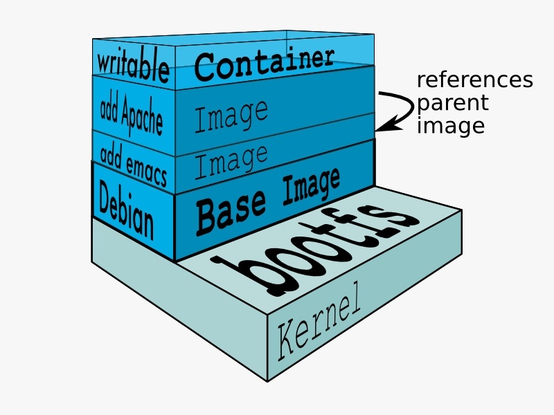

Table of Contents
=================

 * [课程出品人](#课程出品人)
 * [课程简介](#课程简介)
 * [一、概述](#一概述)
    * [1.1 专业术语](#11-专业术语)
    * [1.2 Docker 逻辑架构](#12-docker-逻辑架构)
 * [二、容器镜像基础](#二容器镜像基础)
    * [2.1 容器镜像原理](#21-容器镜像原理)
    * [2.2 Docker 容器存储驱动](#22-docker-容器存储驱动)
 * [三、容器镜像定制](#三容器镜像定制)
 * [3.1 docker commit 方法](#31-docker-commit-方法)
 * [3.2 利用 dockerfile 方法](#32-利用-dockerfile-方法)
    * [3.2.1 什么是 Dockerfile？](#321-什么是-dockerfile)
    * [3.2.2 Dockerfile 指令详解](#322-dockerfile-指令详解)
       * [FROM](#from)
       * [MAINTAINER](#maintainer)
       * [LABEL](#label)
       * [RUN](#run)
       * [COPY](#copy)
       * [ADD](#add)
       * [CMD](#cmd)
       * [ENTRYPOINT](#entrypoint)
       * [ENV](#env)
       * [ARG](#arg)
       * [VOLUME](#volume)
       * [EXPOSE](#expose)
       * [WORKDIR](#workdir)
       * [USER](#user)
       * [HEALTHCHECK](#healthcheck)
       * [ONBUILD](#onbuild)
    * [dockerfile 使用样例](#dockerfile-使用样例)
 * [四、容器镜像优化](#四容器镜像优化)
    * [4.1 减少镜像大小](#41-减少镜像大小)
    * [4.2 精简策略](#42-精简策略)
       * [4.2.1 golang 精简](#421-golang-精简)
       * [4.2.2 使用 scratch 镜像](#422-使用-scratch-镜像)
       * [4.2.2 使用 alpine 镜像](#422-使用-alpine-镜像)
       * [4.2.3 slim 镜像](#423-slim-镜像)
 * [五、容器镜像最佳实践](#五容器镜像最佳实践)
    * [5.1 减少构建时间](#51-减少构建时间)
       * [Tip #1: 构建顺序影响缓存的利用率](#tip-1-构建顺序影响缓存的利用率)
       * [Tip #2: 只拷贝需要的文件，防止缓存溢出](#tip-2-只拷贝需要的文件防止缓存溢出)
       * [Tip #3: 最小化可缓存的执行层](#tip-3-最小化可缓存的执行层)
    * [5.2 减小镜像大小](#52-减小镜像大小)
       * [Tip #4: 删除不必要依赖](#tip-4-删除不必要依赖)
       * [Tip #5: 删除包管理工具的缓存](#tip-5-删除包管理工具的缓存)
    * [5.3 可维护性](#53-可维护性)
       * [Tip #6: 尽量使用官方镜像](#tip-6-尽量使用官方镜像)
       * [Tip #7: 使用更具体的标签](#tip-7-使用更具体的标签)
       * [Tip #8: 使用体积最小的基础镜像](#tip-8-使用体积最小的基础镜像)
    * [5.4 重复利用](#54-重复利用)
       * [Tip #9: 在一致的环境中从源代码构建](#tip-9-在一致的环境中从源代码构建)
       * [Tip #10: 在单独的步骤中获取依赖项](#tip-10-在单独的步骤中获取依赖项)
       * [Tip #11: 使用多阶段构建来删除构建时的依赖项](#tip-11-使用多阶段构建来删除构建时的依赖项)
 * [六、参考文献](#六参考文献)


# 课程出品人

陈强，目前就职于上汽集团云计算中心，容器云架构师及技术经理；
长年在云计算领域搬砖，曾就职于 Intel, IBM, 爱奇艺 等公司；有五年基于 Docker/Mesos/Kubernetes 的云容器研发经验，积累了丰富的生产实践经验，专注于云原生技术的研究。
2020 容器云职业技能大赛百位专家委员会成员。

# 课程简介

如今云容器领域呈现出了百花齐放的姿态，特别是 Docker 容器技术与 Kubernetes 容器编排技术的相得益彰，更加造就了云原生社区火热的今天。这个的背后离不开容器的镜像打包与分发机制，
本章节就来谈谈容器镜像，它是容器技术的重要组成部分，是容器领域最成功的发明，也是 Docker 公司被世人得以称赞的地方，因为是这家公司真正发明了容器镜像的构建方法。它的产生可以让我们开发的业务代码实现了一处打包，多处运行的理想，它将业务代码及其依赖工具包、底层文件系统等按某种格式打包成了一个镜像，这样就保证了代码及其运行环境的一致性。从此，开发与测试人员不用再为了一个 “在我这边运行是好的，是你环境问题” 等这样的事情吵的面红耳赤，拳脚相加了。也可以让开发专注开发，运维专注业务运行的可靠性保障，简化了交接流程，加速了开发效率，推进了敏捷开发。

为了让读者能更好的理解容器镜像及其使用，本章节采用由浅入深的编排结构进行讲解，首先介绍容器镜像的概念及其基础知识，可让初学者对容器的镜像有个初步的了解；接着会通过介绍容器镜像原理，以加深对容器镜像本质的理解，为我们定制镜像打好理论基础，并结合一些实操命令，相信大家会更加容易掌握这块知识；镜像的制作本身比较简单，但在制作容器镜像过程中，如何减少镜像的大小，如何利用镜像构建时的缓存机制，也是我们经常遇到的问题，本章节也会通过分享两种重要的方法来进行镜像制作的优化。最后会分享一些容器镜像安全及其最佳实践的知识，让您足以应付工作所需。

---

本章节主要介绍容器镜像（没有特殊说明，默认指 docker 镜像）部分，docker 容器的其他相关知识（比如： docker 容器的安装、配置、docker command 及 容器仓库等相关知识等），在这里不会介绍，请参考其他相关文章或书箱。

# 一、概述

概述部分会先介绍一些专业术语，如您没有任何容器基础知识，这部分可以让您对容器概念有个大概了解，然后从 Docker 架构上进行介绍，并引出本章的主角-容器镜像，从架构上，我们可以看出容器镜像在容器中的地位及承担的角色。

## 1.1 专业术语

- **镜像**：它是一个特殊的文件系统，除了提供容器运行时所需的程序、库、资源、配置等文件外，还包含了一些为运行时准备的一些配置参数。以 Docker镜像 为例，它是一个只读的模板。比如一个镜像可以包含Ubuntu系统以及安装在Ubuntu上的Apache Web服务器和你自己的应用。镜像是用来创建容器的。Docker提供了一个简单的方式用以创建新的镜像或者更新现存的镜像，甚至你可以下载其他地方提供的镜像。镜像是Docker服务的组件之一。由于Docker使用一个统一文件系统，Docker镜像其实就是一堆文件的集合，并不是像VM那样的是一个操作系统。镜像可以简单到只有一个程序文件，比如如果你写了一个简单的hello world程序放到一个空的镜像中，那么整个镜像的大小，就是你编译后的二进制文件的大小。

- **容器**：镜像（Image）和容器（Container）的关系，就像是面向对象程序设计中的类和实例一样，镜像是静态的定义，容器是镜像运行时的实体。也可以简单理解成程序与进程的关系，容器可以被创建、启动、停止、删除、暂停等。容器是整个容器生态的根本，也是业务运行的载体，是一个由 cgroup/namespace 等实现的轻量级相互隔离的运行时环境。

- **镜像仓库**：存储镜像的地方，可分成公共及私有的镜像仓库。镜像在被构建完成后，可以在当前宿主上运行，但是如果需要在其它服务器上、公司内部、或者互联网中方便的使用这个镜像，就需要一个集中的地方进行存储与分发镜像，镜像仓库为此而生。制作镜像的 maintainer 可以将其推送到镜像仓库，使用者可以从该库中下载。

- **Dockerfile**：是一个用来构建镜像的文本文件，文本内容包含了一条条构建镜像所需的指令和说明。它也是镜像定制的重要方法，镜像的定制实际上就是在打包镜像文件时，用 dockerfile 支持的语法命令行定制镜像层中是否需要配置环境变量、安装软件及拷贝或添加代码文件等操作。它可以把每一层修改、安装、构建、操作的命令都写入这个 dockerfile 文件 ，并在 `docker build` 时，通过按顺序读取该文件，就可以进行构建、定制成一个个 docker 镜像，确保容器构建有章可循。

## 1.2 Docker 逻辑架构

下面我们从 docker 逻辑架构说起，让我们先有一个整体的了解。


这个是容器的整体逻辑架构图，主要由三个逻辑部分组成，最左边的 docker client，中间的 docker host，及右边的 docker registry。

**docker client：** 就是 docker 的客户端，比如我们所输入的命令类似 docker build / docker pull / docker run 等等，都是通过命令行（即客户端）的方式发起的对 docker daemon（可以认为是服务端） 的调用与交互，当然如果我们需要开发，就需要以程序代码的方式，通过调用 docker Restful API 进行与 docker daemon 服务端进行交互。

**docker host：** 也就是容器所在的宿主机，它提供了 docker daemon 赖以生存的地方，也是容器及镜像安置的场所。其中 docker daemon 并不一定需要在每台宿主机上安装部署，它也可以通过特定配置来使用远程主机上的 docker daemon。而容器的 images 及 containers 则必须在宿主机上面。
容器镜像(image)实际上是容器(container)的只读存储层部分，它和最上层的可读写层构成了容器，即 容器 = 镜像层（只读层） + 容器层（读写层）。具体点，当容器启动时，一个新的可写层被加载到了镜像的顶部。也可以简单的认为是程序的代码，容器是该代码运行起来的表现形式（即进程），一静一动形象地表现出了容器技术的本质。

**docker registry：** 就是镜像存放的场所，相当于我们存放代码的仓库 (类似 git repo)，有了镜像仓库我们可以与他人共享制作的镜像。外网可以使用 docker hub ，内网可以使用公司私建的 docker registry，以实现镜像的上传和下拉，实现镜像存储及共存。

# 二、容器镜像基础

接下来我们讲一下容器镜像基础知识，具体包括容器镜像的原理及容器存储方式。通过容器镜像原理的介绍，我们将知道镜像的分层组织思想，它是定制容器镜像的理论支撑。

## 2.1 容器镜像原理

镜像是一种轻量级、可执行的独立软件包，用来打包软件运行环境和基于运行环境开发的软件，它包含运行某个软件所需的所有内容，包括程序代码、运行时库、环境变量和配置文件等。



上图是 Docker 官网的容器的存储结构图。包括最上层的容器层和其下面所有的镜像层。通过此图，我来解释一下 docker 的存储原理。docker 存储，也就是用来组织 docker 镜像的物理方式，它是基于联合文件系统（UnionFS）来实现的。它允许文件是存放在不同的层级上面的，具体点说，就是一种分层、轻量级并且高性能的文件系统，它通过对文件系统的修改作为一次提交来实现层层叠加，并将不同目录挂载到同一个虚拟文件下。最终通过一个统一的视图，看到这些层级上面的所有文件。

- 最底层是 bootfs（boot-file system），只读层，它主要包含 bootloader (加载器)和 kernel (内核)，bootloader 用于引导并加载 kernel，Linux 刚启动时会加载 bootfs 文件系统，在 Docker 镜像的最底层是 bootfs，当其运行时， 可使 bootloader 完成对内核的加载到内存中，此时内存的使用权已由 bootfs 转交给了内核，同时系统也会卸载 bootfs。

- 次底层是 Debian/Ubuntu/Centos 等各发行版的基础镜像（base image)，只读层，其本质就是 rootfs（root-file system）。它是在 bootfs 之上，包含的就是典型 Linux 系统中的 /dev、/proc、/bin、/etc 等标准目录和文件。对于一个精简的操作系统，rootfs 可以很小，只需要包括最基本的命令、工具和程序即可，因为底层直接共享了宿主机的内核。由此可见，对于不同的 Linux 发行版，bootfs 基本是一致的，而 rootfs 会有差别，因此不同的发行版可以共用 bootfs。
　　
- 再上一层是一些辅助工具，只读层，方便我们进入容器中执行一些操作，比如安装 vim, emacs 等。注意这层非必须的，这里只是为了方便说明层级关系而举的例子。

- 再上一层是业务代码层，只读层，它一般是存放应用的代码，也可以是应用程序依赖的动态库，静态包等。
- 最上层是一个容器的读写层。对镜像的修改都发生在此层，此时该层可以通过 docker commit 把它变成一个新的镜像顶层。联合加载会把各层文件系统叠加起来，这样最终的文件系统会包含所有底层的文件和目录。

通过这种分层的思想，容器镜像就可以共享镜像层了，这样节省了大量存储空间。例如多个镜像从相同的父镜像构建而来，那么宿主机只需在磁盘上保存一份父镜像，同时内存中也只需加载一份父镜像就可以为所有容器服务了。

## 2.2 Docker 容器存储驱动

docker 镜像的存储，它的底层是基于不同的文件系统的，所以它的存储驱动也是针对不同的文件系统而定制的，比如 AUFS、Btrfs、OverlayFS, Device mapper 还有 ZFS, VFS 等。docker 对实现了相应文件系统的 graph driver，也就是通过这些驱动把镜像存在磁盘上面。

Docker 的存储驱动架构设计成可插拔的，这可以根据我们的系统环境和使用场景灵活地选择使用一个存储驱动。每个 Docker 存储驱动基于 Linux 文件系统或卷管理器并以其自己独特的方式自由地实现镜像层和容器层的管理。这意味着一些存储驱动在不同的情况下会比其它的驱动有更好的性能表现。
一旦我们决定了使用哪个存储驱动，就可以在 Docker 启动时设置为这个驱动，一般是在 `/etc/docker/daemon.json` 文件中，对 storage-driver 字段进行设置。Docker daemon 只能运行一个存储驱动，之后所有由 docker daemon 创建的容器都使用同样的存储驱动。

这里不会对容器的存储驱动相关技术细节进行展开，请参考其他文献。

# 三、容器镜像定制

本节开始我们将一起来深入容器镜像定制部分。首先，为什么需要定制？镜像定制就类似于平时开发程序一样，可以自由的利用 dockerfile  提供的指令来实现文件系统、基础环境、业务代码的打包来构建镜像，这样该镜像运行起来后，就变成了容器，它就是一个能独立提供特殊功能的程序载体。

我们主要有两种方法来实现镜像的定制，一种是利用 docker commit 方法，另一种是编写 dockerfile 方法，下面分别来介绍一下。

# 3.1 docker commit 方法

`docker commit` 是一种创作镜像的方法。通过它，我们可以将那些在容器中的改动部分以新镜像层的方式保存下来，否则在退出容器时，所有的操作都会被抹掉，不留痕迹。利用这个特性，我们就可以定制镜像了。
具体做法如下：
- 执行 `docker run` 运行一个容器镜像。此时镜像就以进程方式运行于宿主机上。
- 执行 `docker exec` 进入该容器。此时 docker 会默认生成一个空的`容器层`目录，由于这层是可读可写的，所以我们在容器中做的任何对镜像修改的操作（比如增加或删除某个文件等），docker 都会将改动部分写入到此目录下。
- 执行 `docker commit`，它类似于 `git commit`，会将镜像的改动提交到本地存储区，只不过这里是 docker 本地缓存中，并生成一个新的镜像。
- 执行 `docker push`，将该镜像上传到镜像仓库，方便自己或他人在其他主机上运行容器时使用。

下面以在 ubuntu 系统中创建一个文件为例，来演示镜像的制作过程。

首先，我们需要从 docker hub 中下载一个基础镜像，这里以 ubuntu 系统的 18.04 版本为例进行演示。
```bash
$ docker pull ubuntu:18.04
18.04: Pulling from library/ubuntu
a1125296b23d: Pull complete
3c742a4a0f38: Pull complete
4c5ea3b32996: Pull complete
1b4be91ead68: Pull complete
Digest: sha256:e5b0b89c846690afe2ce325ac6c6bc3d686219cfa82166fc75c812c1011f0803
Status: Downloaded newer image for ubuntu:18.04
docker.io/library/ubuntu:18.04
```
从上面可以看出，其实是从 docker.io 公司提供的 docker hub 镜像仓库中的 libary 这个 repo 中下载了 ubuntu，并使用的是 18.04 这个标签版本。每一层都是经过 hash 算法生成的 ID，通过各层 ID 可以观察到该镜像的层次结构。

下面通过 `docker run` 启动此镜像，并通过 `--name` 命名成 commit-demo，它是默认生成的以 hash ID 为名的容器的别名，所以我们也可以通过指定 commit-demo 来访问，比如 `docker exec -it commit-demo /bin/bash`

```bash
$ docker run --name commit-demo -it ubuntu:18.04 /bin/bash
root@c2980bd0f64d:/# ls
bin  boot  dev  etc  home  lib  lib64  media  mnt  opt  proc  root  run  sbin  srv  sys  tmp  usr  var
root@c2980bd0f64d:/# touch chenqiang-demo
root@c2980bd0f64d:/# ls
bin  boot  chenqiang-demo  dev  etc  home  lib  lib64  media  mnt  opt  proc  root  run  sbin  srv  sys  tmp  usr  var
root@c2980bd0f64d:/# echo "hello everyone, this is a demo to create image with docker commit" > chenqiang-demo
root@c2980bd0f64d:/# cat chenqiang-demo
hello everyone, this is a demo to create image with docker commit
```

为了演示容器对底层镜像产生的修改，我们通过 touch 来创建一个文件 （chenqiang-demo），并在该文件中写入一些字符。

下面通过 `docker ps` 可以看到运行的容器，然后为了将修改的文件（chenqiang-demo）重新做成镜像，通过 docker commit 进行提交并保存，`-a` 指定了制作人信息，`-m` 指定了备注信息，最后指定了新的镜像名与标签名(ubuntu:18.04-demo)，它代表了一个新的镜像。当然还有其他的方法，docker load 与 docker save 等来实现镜像的打包。

```bash
$ docker ps
CONTAINER ID        IMAGE               COMMAND             CREATED             STATUS              PORTS               NAMES
c2980bd0f64d        ubuntu:18.04        "/bin/bash"         3 minutes ago       Up 3 minutes                            commit-demo
$ docker commit -a "chenqiang" -m "this is a demo to create image with docker commit" c2980bd0f64d ubuntu:18.04-demo
sha256:8dba5968a74dd6ca898d3e48af47c356e1bdeb9a154d722cc16d7fd5dc9d5c11
$ docker images
REPOSITORY                                        TAG                  IMAGE ID            CREATED             SIZE
ubuntu                                            18.04-demo           8dba5968a74d        11 seconds ago      64.2MB
ubuntu                                            18.04                d27b9ffc5667        2 days ago          64.2MB
$ docker run -t ubuntu:18.04-demo cat ./chenqiang-demo
hello everyone, this is a demo to create image with docker commit
```
访问上面通过 docker commit 制作的镜像 ubuntu:18.04-demo，我们可以发现其输出和制作时的保持一致，这个正验证了其镜像制作的可行性。

上面这种定制镜像的方法比较简单，不需要熟悉 dockerfile 命令，就可以很轻松的完成镜像的制作。但这种方法是手动修改镜像，不方便自动化生成，也容易出错，在业界使用的比较少。通过上面的演示，希望您能更加深入的理解容器镜像的分层及存储思想。

# 3.2 利用 dockerfile 方法

接下来，详细介绍一下使用 dockerfile 文本来构建镜像时使用的一些常用命令，并结合一个样例来实际构建一个镜像说明该方法的工作原理。

## 3.2.1 什么是 Dockerfile？

本章节多次提到 Dockerfile 是一个用来构建镜像的文本文件，文本内容包含了一条条构建镜像所需的指令和说明。
Dockerfile 的基本结构一般分为四个部分：基础镜像信息、维护者信息、镜像操作指令和容器启动时的执行指令信息，注意 `’#’` 打头的为 Dockerfile 中的注释。

## 3.2.2 Dockerfile 指令详解

### FROM

指定基础镜像，必须为第一个指令，指定了从哪个基础镜像开始。其中 tag 或 digest 是可选的，如果不使用这两个值时，会使用 latest 版本的基础镜像。

**格式：**
```
FROM <image>
FROM <image>:<tag>
FROM <image>@<digest>
```
**示例：**
`FROM mysql:5.6`

### MAINTAINER

指定镜像制作人信息，可忽略不写。该指令已经过期，现在使用 LABEL 代替，例如：
`LABEL maintainer "chenqiangzhishen@163.com"`

### LABEL

使用 LABEL 设置镜像元数据，例如镜像创建者或者镜像说明。有时，一些外部程序需要用到镜像的元数据，例如 nvidia-docker 需要用到 com.nvidia.volumes.needed。那么在使用 LABEL 指定元数据时，一条 LABEL 指令可以指定一或多条元数据，指定多条元数据时不同元数据之间通过空格分隔。推荐将所有的元数据通过一条 LABEL 指令指定，以免生成过多的中间镜像。

**格式：**
    `LABEL <key>=<value> <key>=<value> <key>=<value> ...`
**示例：**
　　`LABEL version="1.0" description="这是一个 Nginx 服务器" by="chenqiangzhishen@163.com"`

### RUN

用于执行后面跟着的命令行指令，如安装特定的软件等。RUN 指令创建的中间镜像会被缓存，并会在下次构建中使用。如果不想使用这些缓存镜像，可以在构建时指定 `--no-cache` 参数，如：`docker build --no-cache .`

其有以下两种命令执行方式：
- shell 执行
**格式：** `RUN <command>`
- exec 执行
**格式：** `RUN ["可执行文件", "参数1", "参数2"]`
**示例：**
    ```
    RUN ["executable", "param1", "param2"]
    RUN apk update
    RUN ["/etc/execfile", "arg1", "arg1"]
    RUN ["./test.php", "dev", "offline"] 等价于 RUN ./test.php dev offline
    ```
### COPY

复制指令，从上下文目录中复制文件或者目录到容器里指定的路径。不会自动解压文件，也不能访问网络上的资源，即源路径不能是网络地址，比如 FTP 服务器等。

**格式：**

```
COPY [--chown=<user>:<group>] <源路径1>...  <目标路径>
COPY [--chown=<user>:<group>] ["<源路径1>",...  "<目标路径>"]
```

**`[--chown=<user>:<group>]`**：可选参数，用户改变复制到容器内文件的拥有者和属组。

**<源路径>**：源文件或者源目录，这里可以是通配符表达式，其通配符规则要满足 Go 的 `filepath.Match` 规则。例如：

```
COPY hom* /mydir/
COPY hom?.txt /mydir/
```

**<目标路径>**：容器内的指定路径，该路径无需提前创建好，路径不存在的话，将会自动创建。

### ADD
ADD 指令和 COPY 的使用格式一致（同样需求下，官方推荐使用 COPY），功能也类似，不同之处如下：

- ADD 的优点：如果 <源文件> 为 tar 格式的压缩文件的话，比如压缩格式为 gzip, bzip2 等情况下，会自动复制并**解压**到 <目标路径>。但网络压缩资源不会被解压，虽然其可以访问网络资源，类似 wget 下载功能。
- ADD 的缺点：在不解压的前提下，无法复制 tar 压缩文件。会令镜像构建缓存失效，这样会使镜像构建变得比较缓慢。

### CMD
类似于 RUN 指令，用于运行程序，但二者运行的时间点不同，CMD 用于指定在容器启动时所要执行的命令，而 RUN 用于指定镜像构建时所要执行的命令。

**作用：** 为启动的容器指定默认要运行的程序，程序运行结束，容器也就结束。CMD 指令指定的程序可被 docker run 命令行参数中指定要运行的程序所覆盖。

**注意**：如果 Dockerfile 中存在多个 CMD 指令，仅最后一个生效。

```
CMD <shell 命令> 
CMD ["<可执行文件或命令>","<param1>","<param2>",...] 
CMD ["<param1>","<param2>",...]  # 该写法是为 ENTRYPOINT 指令指定的程序提供默认参数
```
**示例：**
```
CMD echo "This is a test." | wc -
CMD ["/usr/bin/wc","--help"]
```
推荐使用第二种格式，其执行过程比较明确。第一种格式实际上在运行的过程中也会自动转换成第二种格式运行，并且默认可执行文件是 sh，而不是 bash。

### ENTRYPOINT

类似于 CMD 指令，但其不会被 docker run 的命令行参数指定的指令所覆盖，而且这些命令行参数会被当作参数传给 ENTRYPOINT 指令指定的程序。

但是，如果运行 docker run 时使用了 `--entrypoint` 选项，此选项的参数可当作要运行的程序覆盖 ENTRYPOINT 指令指定的程序。

**优点：** 在执行 docker run 的时候可以指定 ENTRYPOINT 运行所需的参数。

**注意：** 如果 Dockerfile 中存在多个 ENTRYPOINT 指令，仅最后一个生效。

**格式：**

```
ENTRYPOINT ["<executeable>","<param1>","<param2>",...]
```

可以搭配 CMD 命令使用：一般是变参才会使用 CMD ，这里的 CMD 等于是在给 ENTRYPOINT 传参，以下示例会提到。

**示例：**

假设已通过 Dockerfile 构建了 nginx:test 镜像：

```
FROM nginx

ENTRYPOINT ["nginx", "-c"] # 定参
CMD ["/etc/nginx/nginx.conf"] # 变参 
```

- 1、不传参运行情况

`$ docker run  nginx:test`
容器内会默认运行以下命令，启动主进程。

`$ nginx -c /etc/nginx/nginx.conf`
- 2、传参运行情况

`$ docker run  nginx:test -c /etc/nginx/nginx_new.conf`
容器内会默认运行以下命令来启动主进程(当然，我们假定容器中已经存在 `/etc/nginx/nginx_new.conf` 文件)

`$ nginx -c /etc/nginx/nginx_new.conf`

### ENV

在 Linux 等系统中，我们一般是在 /etc/profile 等目录或相关文件内配置环境变量，但如果我们在 dockerfile 中也采用此方式，则不会生效。所以 dockerfile 引入了 ENV 指令来设置镜像中的环境变量，这样在后续的指令中，就可以使用这个环境变量。
**格式：**
```
ENV <key> <value>
ENV <key1>=<value1> <key2>=<value2>...
```
以下示例设置 `NODE_VERSION = 7.2.0` ， 在后续的指令中可以通过 `$NODE_VERSION` 引用：

```
ENV NODE_VERSION 7.2.0

RUN curl -SLO "https://nodejs.org/dist/v$NODE_VERSION/node-v$NODE_VERSION-linux-x64.tar.xz" \
  && curl -SLO "https://nodejs.org/dist/v$NODE_VERSION/SHASUMS256.txt.asc"
```

### ARG
构建参数，与 ENV 作用一样。不过作用域不一样。ARG 设置的环境变量仅对 Dockerfile 内有效，也就是说只有 docker build 的过程中有效，构建好的镜像内不存在此环境变量。

构建命令 docker build 中可以用 `--build-arg <参数名>=<值>` 来覆盖。

**格式：**

`ARG <参数名>[=<默认值>]`

### VOLUME
定义匿名数据卷。在启动容器时忘记挂载数据卷，会自动挂载到匿名卷。

**作用：**

避免重要的数据，因容器重启而丢失，还可以避免容器不断变大。一个卷可以存在于一个或多个容器的指定目录，该目录可以绕过联合文件系统，并具有以下功能：
- 卷可以在容器间共享和重用
- 容器并不一定要和其它容器共享卷
- 修改卷后会立即生效
- 对卷的修改不会对镜像产生影响
- 卷会一直存在，即使删除容器，volume仍然会存在

**格式：**

```
VOLUME ["<路径1>", "<路径2>"...]
VOLUME <路径>
```
**示例：**
```
VOLUME ["/data"]
VOLUME ["/var/www", "/var/log/apache2", "/etc/apache2"]
```

在启动容器 docker run 的时候，我们可以通过 -v 参数修改挂载点。

### EXPOSE

开放容器内的端口，但不和宿主机进行映射。方便在宿主机上进行开发测试。
**作用：**

帮助镜像使用者理解这个镜像服务的守护端口，以方便配置映射。
如需映射到宿主机端口，不指定端口时，使用随机端口映射，也就是 `docker run -P` 时，会自动随机映射 EXPOSE 的端口。
如果需要指定，则可在运行容器时使用 `-p host_port:container_port`。

**格式：**

`EXPOSE <端口1> [<端口2>...]`

### WORKDIR
指定工作目录。用 WORKDIR 指定的工作目录，会在构建镜像的每一层中都存在。（WORKDIR 指定的工作目录，必须是提前创建好的）。

docker build 构建镜像过程中的，每一个 RUN 命令都是新建的一层。只有通过 WORKDIR 创建的目录才会一直存在。

通过 WORKDIR 设置工作目录后，Dockerfile 中其后的命令如 RUN、CMD、ENTRYPOINT、ADD、COPY 等命令都会在该目录下执行。在使用 docker run 运行容器时，可以通过 `-w` 参数覆盖构建时所设置的工作目录。

格式：

`WORKDIR <工作目录路径>`

**示例：**

```
WORKDIR /a  (这时工作目录为/a)
WORKDIR b  (这时工作目录为/a/b)
WORKDIR c  (这时工作目录为/a/b/c)
```
### USER
指定运行容器时的用户名或 UID，后续的 RUN 也会使用指定用户。使用 USER 指定用户时，可以使用用户名、UID 或 GID，或是两者的组合。当服务不需要管理员权限时，可以通过该指令指定运行用户。并且可以在之前创建所需要的用户。使用 USER 指定用户后，Dockerfile 中其后的命令比如 RUN、CMD、ENTRYPOINT 等都将使用该用户。镜像构建完成后，通过 docker run 运行容器时，可以通过 `-u` 参数来覆盖所指定的用户。

**格式：**

```
USER <用户名>[:<用户组>]
USER user
USER user:group
USER uid
USER uid:gid
USER user:gid
USER uid:group
```
**示例：**
`USER www`

### HEALTHCHECK
用于指定某个程序或者指令来监控 docker 容器服务的运行状态。运行容器时，可以指定 `--restart always` 选项，使的当容器崩溃时，Docker 守护进程会重启容器，这对于需要长时间运行的容器，这个选项非常有用。但是此参数不能做健康检查，即如果容器中的服务不可用，比如配置出错，程序 hang 住等，其还会一直在运行，但其实不能正常提供服务了，前面说的 `--restart` 参数就不会触发容器重启，那我们就可以使用 HEALTHCHECK 指令来让 Docker 周期性的检查容器的健康状况。我们只需要指定一个命令，如果一切正常的话返回 0，否则返回 1。对 HEALTHCHECK 感兴趣的话，可以参考[这篇博客](https://blog.newrelic.com/engineering/docker-health-check-instruction/)

**格式：**

`HEALTHCHECK [选项] CMD <命令>`：设置检查容器健康状况的命令。
`HEALTHCHECK NONE`：如果基础镜像有健康检查指令，使用这行可以屏蔽掉其健康检查指令。

### ONBUILD
用于延迟构建命令的执行，类似于触发器。简单的说，就是 Dockerfile 里用 ONBUILD 指定的命令，在本次构建镜像的过程中不会执行（假设镜像为 test-build），但在使用它的 Dockerfile （即 `FROM test-build`）中，docker build 时 ONBUILD 指定的命令就会被触发执行。

**格式：**

`ONBUILD <其它指令>`

**示例：**

```
ONBUILD ADD . /app/src
ONBUILD RUN /usr/local/bin/python-build --dir /app/src
```

## dockerfile 使用样例

下面给出一个详细的使用 dockerfile 的案例，通过上面知识点的掌握，相信您能看懂如下内容了。如果还有些不明白，可参考一下简要注释。

```dockerfile
# 指定从某个基础镜像开始定制，通常指定官方制作好的镜像，它们除了功能保证之外，在镜像大小、安全性方面做了很多优化。
# 不要使用 latest 标签或不指定标签，因为每个构建时间点对应的 latest标签中的镜像内容可能也会不一样。
FROM node:7-alpine
# 指定镜像制作人信息
LABEL maintainer "chenqiangzhishen@163.com"
# 设定环境变量
ENV PROJECT_DIR=/app
# 指定容器启动时的工作目录
WORKDIR $PROJECT_DIR
# 添加所需要文件到容器镜像中，一起打包到镜像中
COPY package.json $PROJECT_DIR
# 安装 npm
RUN npm install
# 打包上下文中的内容
COPY . $PROJECT_DIR
# 定义后面需要使用的环境变量
ENV MEDIA_DIR=/media \
    NODE_ENV=production \
    APP_PORT=3000
# 指定卷挂载目录
VOLUME $MEDIA_DIR
# 指定该服务需要暴露的端口
EXPOSE $APP_PORT
# 进行运行时健康检查，这个非常有用
HEALTHCHECK CMD curl --fail http://localhost:$APP_PORT || exit 1
# 指定容器启动时，率先需要执行的程序（即程序入口点）
ENTRYPOINT ["./entrypoint.sh"]
# 传参到程序入口点
CMD ["start"]
```

有了上面这个 Dockerfile，在当前上下文中，执行 `docker build -t node:7-alpine-demo .` 即可以生成 `node:7-alpine-demo` 镜像了。如果在用 docker build 构建过程中遇到了问题，就先解决后，再进行构建，如果 dockerfile 写的好的话，重新进行构建时，由于会利用之前构建过的缓存，速度会比较快，这也是调试 dockerfile 的方法之一。具体如何优化 dockerfile ，可看接下来的内容。

# 四、容器镜像优化

对于刚接触容器的人来说，很容易被自己制作的 Docker 镜像大小所吓到，我只需要一个几 MB 的可执行文件而已，为何镜像的大小会达到 1 GB 以上? 下面将从两方面来进行镜像大小优化，一种是通过多阶段构建处理，一种是使用不同的基础镜像进行特定优化与精简。

## 4.1 减少镜像大小
这部分着重介绍多阶段构建（multi-stage builds），因为这是镜像精简之路至关重要的一环。在这部分内容中，我会解释静态链接和动态链接的区别，它们对镜像带来的影响，以及如何避免那些不好的影响。

我们还是从 hello world 的程序开始，用 C 语言实现如下：

```
/* hello.c */
int main () {
  puts("Hello, world!");
  return 0;
}

```
然后为其编写 Dockerfile，如下：

```dockerfile
FROM gcc
COPY hello.c .
RUN gcc -o hello hello.c
CMD ["./hello"]
```
执行 `docker build -t hello:gcc .`进行构建后，发现镜像大小超过了 1 GB。因为该镜像包含了整个 gcc 镜像的内容。但其实编译好的代码可执行文件只有 8.4 KB，这显然不科学。


换个安装了 C 编译器的 Ubuntu 镜像看看，会得到一个大概 300 MB 大小的镜像，缩小了 3 倍，但还是比 8.4 KB 大太多了。
类似地，Go 语言版本的 hello world 会得到相同的结果：
```
package main

import "fmt"

func main () {
  fmt.Println("Hello, world!")
}
```
使用基础镜像 golang 构建的镜像大小是 800 MB，而编译后的可执行文件只有 2 MB 大小，看来这个起决定性因素的还是基础镜像，那我们如何减小呢？**请采用多阶段构建的方法**。
我们还是以 C 语言的来看看，要想大幅度减少镜像的大小，多阶段构建是必不可少的。多阶段构建的想法很简单：“我不想在最终的镜像中包含一堆 C 或 Go 编译器和整个编译工具链，我只要一个编译好的可执行文件！”。

多阶段构建可以由多个 FROM 指令识别，每一个 FROM 语句表示一个新的构建阶段，阶段名称可以用 AS 参数指定，例如：
```
FROM gcc AS mybuildstage
COPY hello.c .
RUN gcc -o hello hello.c
FROM ubuntu
COPY --from=mybuildstage hello .
CMD ["./hello"]
```
这里使用基础镜像 gcc 来编译程序 hello.c，然后启动一个新的构建阶段，它以 ubuntu 作为基础镜像，将可执行文件 hello 从上一阶段拷贝到最终的镜像中。最终的镜像大小是 73.9MB，比之前的 1.19 GB 减少了 95%。


在声明构建阶段时，可以不必使用关键词 AS，最终阶段拷贝文件时可以直接使用序号表示之前的构建阶段（从零开始）。也就是说，下面两行是等效的：
```
COPY --from=mybuildstage hello .
COPY --from=0 hello .
```

如果 Dockerfile 内容不是很复杂，构建阶段也不是很多，可以直接使用序号表示构建阶段。一旦 Dockerfile 变复杂了，构建阶段增多了，最好还是通过关键词 AS 为每个阶段命名，这样也便于后期维护。
细心的你，可能会发现上面以 ubuntu 为基础镜像还是大了些，能不能选择一个更小的镜像呢？当然可以，我们可以采用 busybox 或 alpine 镜像来替代该 ubuntu 镜像。

## 4.2 精简策略

这部分将会针对不同的基础镜像进行精简，比如 scratch, alpine, slim 等，还可以从语言层面进行精简，会以 golang 语言为例进行分析。

### 4.2.1 golang 精简

Go 语言程序编译时会将所有必须的依赖编译到二进制文件中，但也不能完全肯定它使用的是静态链接，因为 Go 的某些包是依赖系统标准库的，例如使用到 DNS 解析的包。只要代码中导入了这些包，编译的二进制文件就需要调用到某些系统库，为了这个需求，Go 实现了一种机制叫 cgo，以允许 Go 调用 C 代码，这样编译好的二进制文件就可以调用系统库。也就是说，如果 Go 程序使用了 net 包，就会生成一个动态的二进制文件，如果想让镜像能够正常工作，必须将需要的库文件复制到镜像中，或者直接使用 busybox:glibc 镜像。当然，你也可以禁止 cgo，这样 Go 就不会使用系统库，使用内置的实现来替代系统库（例如使用内置的 DNS 解析器），这种情况下生成的二进制文件就是静态的。可以通过设置环境变量 CGO_ENABLED=0 来禁用 cgo，例如：

```
FROM golang
COPY whatsmyip.go .
ENV CGO_ENABLED=0
RUN go build whatsmyip.go

FROM scratch
COPY --from=0 /go/whatsmyip .
CMD ["./whatsmyip"]
```
由于编译生成的是静态二进制文件，因此可以直接跑在 scratch 镜像中（下面会介绍）。
当然，也可以不用完全禁用 cgo，可以通过 `-tags` 参数指定需要使用的内建库，例如 `-tags netgo` 就表示使用内建的 net 包，不依赖系统库：

`$ go build -tags netgo whatsmyip.go`

这样指定之后，如果导入的其他包都没有用到系统库，那么编译得到的就是静态二进制文件。也就是说，只要还有一个包用到了系统库，都会开启 cgo，最后得到的就是动态二进制文件。要想一劳永逸，还是设置环境变量 CGO_ENABLED=0 吧。

### 4.2.2 使用 scratch 镜像

scratch镜像很小，因为它基本上是空的，除了 docker 给它额外添加的 metadata（元数据：描述数据的数据）。它是一个虚拟镜像，不能被 pull，也不能运行，因为它表示空！scratch镜像不可以直接从 docker 官方拉取下来，但可以用以下命令构建这个 scratch 镜像：

```
$ tar cv --files-from /dev/null | docker import - scratch
$ docker image ls
REPOSITORY              TAG                 IMAGE ID            CREATED             SIZE
scratch                 latest              775bfce21429        3 minutes ago       0B
```
从镜像大小可知，scratch 镜像大小为 0，scratch 构建镜像时，可精简到只在 scratch 上面加一层代码生成的二进制可执行文件。可以用于构建 busybox 等超小镜像，可以说是真正的从零开始构建属于自己的镜像。
在构建二进制可执行文件的时候，需要进行静态编译链接，因为 scratch 中没有我们需要的动态链接库。比如：
`CGO_ENABLED=0 GOOS=linux GOARCH=arm64 go build -o empty –a -ldflags '-s' emptyImageProject/`
所以如果您追求镜像极小的话，可以使用 scratch 镜像配合多阶段处理来构建业务镜像。其缺点是：缺少 shell，缺少调试工具、缺少 libc 等基础库。

### 4.2.2 使用 alpine 镜像

Alpine 是众多 Linux 发行版中的一员，和 CentOS、Ubuntu、Archlinux 之类一样，只是一个发行版的名字，号称小巧安全，有自己的包管理工具 apk。与 CentOS 和 Ubuntu 不同，Alpine 并没有像 Red Hat 或 Canonical 之类的大公司为其提供维护支持，软件包的数量也比这些发行版少很多（如果只看开箱即用的默认软件仓库，Alpine 只有 10000 个软件包，而 Ubuntu、Debian 和 Fedora 的软件包数量均大于 50000。）

容器崛起之前，Alpine 还是个无名之辈，可能是因为大家并不是很关心操作系统本身的大小，毕竟大家只关心业务数据和文档，程序、库文件和系统本身的大小通常可以忽略不计。

容器技术席卷整个软件产业之后，大家都注意到了一个问题，那就是容器的镜像太大了，浪费磁盘空间，拉取镜像的时间也很长。于是，人们开始寻求适用于容器的更小的镜像。对于那些耳熟能详的发行版（例如 Ubuntu、Debian、Fedora）来说，只能通过删除某些工具（例如 ifconfig 和 netstat）将镜像体积控制在 100M 以下。而对于 Alpine 而言，什么都不用删除，镜像大小也就只有 5M 而已。

Alpine 镜像的另一个优势是包管理工具的执行速度非常快，安装软件体验非常顺滑。诚然，在传统的虚拟机上不需要太关心软件包的安装速度，同一个包只需要装一次即可，无需不停重复安装。容器就不一样了，你可能会定期构建新镜像，也可能会在运行的容器中临时安装某些调试工具，如果软件包的安装速度很慢，会很快消磨掉我们的耐心。

为了更直观，我们来做个简单的对比测试，看看不同的发行版安装 tcpdump 需要多长时间，测试命令如下：


```
$ time docker run <image> <packagemanager> install tcpdump
测试结果如下：

Base image           Size      Time to install tcpdump
---------------------------------------------------------
alpine:3.11          5.6 MB      1-2s
archlinux:20200106   409 MB      7-9s
centos:8             237 MB      5-6s
debian:10            114 MB      5-7s
fedora:31            194 MB    35-60s
ubuntu:18.04          64 MB      6-8s
```
既然 apline 镜像除了小之外，工具包的安装速度也快，那我们在挑选各种语言版本的基础镜像时，可以优先选择带 `alpine` 的 tag 的镜像。比如 golang:alpine 就提供了基于 Alpine 构建的 Go 工具链。
```
FROM golang:alpine
COPY hello.go .
RUN go build hello.go

FROM alpine
COPY --from=0 /go/hello .
CMD ["./hello"]
```
生成的镜像大小为 7.5M，对于一个只打印 hello world 的程序来说确实有点大了，但我们可以换个角度：

即使程序很复杂，生成的镜像也不会很大。
包含了很多有用的调试工具。
即使运行时缺少某些特殊的调试工具，也可以迅速安装。
Go 语言搞定了，C 语言呢？并没有 gcc:alpine 这样的镜像啊。只能以 Alpine 镜像作为基础镜像，自己安装 C 编译器了，Dockerfile 如下：

```
FROM alpine
RUN apk add build-base
COPY hello.c .
RUN gcc -o hello hello.c

FROM alpine
COPY --from=0 hello .
CMD ["./hello"]
```

最后来对比一下不同构建方法得到的 hello world 镜像大小：
- 使用基础镜像 golang 构建：805MB
- 多阶段构建，build 阶段使用基础镜像 golang，run 阶段使用基础镜像 ubuntu：66.2MB
- 多阶段构建，build 阶段使用基础镜像 golang:alpine，run 阶段使用基础镜像 alpine：7.6MB
- 多阶段构建，build 阶段使用基础镜像 golang，run 阶段使用基础镜像 scratch：2MB

最终镜像体积减少了 99.75%，相当惊人了。

### 4.2.3 slim 镜像
如果实在不想折腾，可以选择一个折衷的镜像 xxx:slim。slim 镜像一般都基于 Debian 和 glibc，删除了许多非必需的软件包，优化了体积。如果构建过程中需要编译器，那么 slim 镜像不适合，除此之外大多数情况下还是可以使用 slim 作为基础镜像的。

下面是主流的解释型语言的 Alpine 镜像和 slim 镜像大小对比：
```
Image            Size
---------------------------
node             939 MB
node:alpine      113 MB
node:slim        163 MB
python           932 MB
python:alpine    110 MB
python:slim      193 MB
ruby             842 MB
ruby:alpine       54 MB
ruby:slim        149 MB
```
再来举个特殊情况的例子，同时安装 matplotlib，numpy 和 pandas，不同的基础镜像构建的镜像大小如下：

```
Image and technique         Size
--------------------------------------
python                      1.26 GB
python:slim                  407 MB
python:alpine                523 MB
python:alpine multi-stage    517 MB
```

可以看到这种情况下使用 Alpine 并没有任何帮助，即使使用多阶段构建也无济于事。但也不能全盘否定 Alpine，比如下面这种情况：包含大量依赖的 Django 应用。

```
Image and technique         Size
--------------------------------------
python                      1.23 GB
python:alpine                636 MB
python:alpine multi-stage    391 MB
```
最后来总结一下：到底使用哪个基础镜像并不能盖棺定论，有时使用 Alpine 效果更好，有时反而使用 slim 效果更好，如果你对镜像体积有着极致的追求，可以这两种镜像都尝试一下。相信随着时间的推移，我们就会积累足够的经验，知道哪种情况该用 Alpine，哪种情况该用 slim，不用再一个一个尝试。

# 五、容器镜像最佳实践

如今 GitHub 仓库中已经包含了成千上万的 Dockerfile，但并不是所有的 Dockerfile 都是高效的。本节将从减少构建时间、减小镜像体积、可维护性、安全和重复利用五个方面来介绍 Dockerfile 的最佳实践，以此来帮助大家编写更优雅的 Dockerfile。

本节使用一个基于 Maven 的 Java 项目作为示例，然后不断改进 Dockerfile 的写法，直到最后写出一个最优雅的 Dockerfile。中间的所有步骤都是为了说明某一方面的最佳实践。

## 5.1 减少构建时间

一个开发周期包括构建 Docker 镜像，更改代码，然后重新构建 Docker 镜像。在构建镜像的过程中，如果能够利用缓存，可以减少不必要的重复构建步骤。

### Tip #1: 构建顺序影响缓存的利用率


镜像的构建顺序很重要，当你向 Dockerfile 中添加文件，或者修改其中的某一行时，那一部分的缓存就会失效，该缓存的后续步骤都会中断，需要重新构建。所以优化缓存的最佳方法是把不需要经常更改的行放到最前面，更改最频繁的行放到最后面。

### Tip #2: 只拷贝需要的文件，防止缓存溢出


当拷贝文件到镜像中时，尽量只拷贝需要的文件，切忌使用 `COPY .` 指令拷贝整个目录。如果被拷贝的文件内容发生了更改，缓存就会被破坏。在上面的示例中，镜像中只需要构建好的 jar 包，因此只需要拷贝这个文件就行了，这样即使其他不相关的文件发生了更改也不会影响缓存。

### Tip #3: 最小化可缓存的执行层


每一个 RUN 指令都会被看作是可缓存的执行单元。太多的 RUN 指令会增加镜像的层数，增大镜像体积，而将所有的命令都放到同一个 RUN 指令中又会破坏缓存，从而延缓开发周期。当使用包管理器安装软件时，一般都会先更新软件索引信息，然后再安装软件。推荐将更新索引和安装软件放在同一个 RUN 指令中，这样可以形成一个可缓存的执行单元，否则你可能会安装旧的软件包。

## 5.2 减小镜像大小

镜像的大小很重要，因为镜像越小，部署的速度更快，攻击范围越小。

### Tip #4: 删除不必要依赖


删除不必要的依赖，不要安装调试工具。如果实在需要调试工具，可以在容器运行之后再安装。某些包管理工具（如 apt）除了安装用户指定的包之外，还会安装推荐的包，这会无缘无故增加镜像的体积。apt 可以通过添加参数 -–no-install-recommends 来确保不会安装不需要的依赖项。如果确实需要某些依赖项，请在后面手动添加。

### Tip #5: 删除包管理工具的缓存


包管理工具会维护自己的缓存，这些缓存会保留在镜像文件中，推荐的处理方法是在每一个 RUN 指令的末尾删除缓存。如果你在下一条指令中删除缓存，不会减小镜像的体积。

当然了，还有其他更高级的方法可以用来减小镜像体积，如下文将会介绍的多阶段构建。接下来我们将探讨如何优化 Dockerfile 的可维护性、安全性和可重复性。

## 5.3 可维护性
### Tip #6: 尽量使用官方镜像


使用官方镜像可以节省大量的维护时间，因为官方镜像的所有安装步骤都使用了最佳实践。如果你有多个项目，可以共享这些镜像层，因为他们都可以使用相同的基础镜像。

### Tip #7: 使用更具体的标签


基础镜像尽量不要使用 latest 标签。虽然这很方便，但随着时间的推移，latest 镜像可能会发生重大变化。因此在 Dockerfile 中最好指定基础镜像的具体标签。我们使用 openjdk 作为示例，指定标签为 8。其他更多标签请查看官方仓库。

### Tip #8: 使用体积最小的基础镜像


基础镜像的标签风格不同，镜像体积就会不同。slim 风格的镜像是基于 Debian 发行版制作的，而 alpine 风格的镜像是基于体积更小的 Alpine Linux 发行版制作的。其中一个明显的区别是：Debian 使用的是 GNU 项目所实现的 C 语言标准库，而 Alpine 使用的是 Musl C 标准库，它被设计用来替代 GNU C 标准库（glibc）的替代品，用于嵌入式操作系统和移动设备。因此使用 Alpine 在某些情况下会遇到兼容性问题。以 openjdk 为例，jre 风格的镜像只包含 Java 运行时，不包含 SDK，这么做也可以大大减少镜像体积。

## 5.4 重复利用

到目前为止，我们一直都在假设你的 jar 包是在主机上构建的，这还不是理想方案，因为没有充分利用容器提供的一致性环境。例如，如果你的 Java 应用依赖于某一个特定的操作系统的库，就可能会出现问题，因为环境不一致（具体取决于构建 jar 包的机器）。

### Tip #9: 在一致的环境中从源代码构建
源代码是你构建 Docker 镜像的最终来源，Dockerfile 里面只提供了构建步骤。


首先应该确定构建应用所需的所有依赖，本文的示例 Java 应用很简单，只需要 Maven 和 JDK，所以基础镜像应该选择官方的体积最小的 maven 镜像，该镜像也包含了 JDK。如果你需要安装更多依赖，可以在 RUN 指令中添加。pom.xml 文件和 src 文件夹需要被复制到镜像中，因为最后执行 mvn package 命令（-e 参数用来显示错误，-B 参数表示以非交互式的“批处理”模式运行）打包的时候会用到这些依赖文件。

虽然现在我们解决了环境不一致的问题，但还有另外一个问题：每次代码更改之后，都要重新获取一遍 pom.xml 中描述的所有依赖项。下面我们来解决这个问题。

### Tip #10: 在单独的步骤中获取依赖项


结合前面提到的缓存机制，我们可以让获取依赖项这一步变成可缓存单元，只要 pom.xml 文件的内容没有变化，无论代码如何更改，都不会破坏这一层的缓存。上图中两个 COPY 指令中间的 RUN 指令用来告诉 Maven 只获取依赖项。

现在又遇到了一个新问题：跟之前直接拷贝 jar 包相比，镜像体积变得更大了，因为它包含了很多运行应用时不需要的构建依赖项。

### Tip #11: 使用多阶段构建来删除构建时的依赖项


上面章节已经说过了，多阶段构建可以由多个 FROM 指令识别，每一个 FROM 语句表示一个新的构建阶段，阶段名称可以用 AS 参数指定。本例中指定第一阶段的名称为 builder，它可以被第二阶段直接引用。两个阶段环境一致，并且第一阶段包含所有构建依赖项。

第二阶段是构建最终镜像的最后阶段，它将包括应用运行时的所有必要条件，本例是基于 Alpine 的最小 JRE 镜像。上一个构建阶段虽然会有大量的缓存，但不会出现在第二阶段中。为了将构建好的 jar 包添加到最终的镜像中，可以使用 `COPY --from=STAGE_NAME` 指令，其中 `STAGE_NAME` 是上一构建阶段的名称。


多阶段构建是删除构建依赖的首选方案。

上面我们从在非一致性环境中构建体积较大的镜像开始优化，一直优化到在一致性环境中构建最小镜像，并充分利用了缓存机制。当然还有其他的一些最佳实践，这里不再举例了。

到目前为止，容器镜像的定制分享完毕，还需要深入的话，可以参考其他类似文献。

# 六、参考文献

https://blog.csdn.net/vchy_zhao/article/details/70238690
https://www.runoob.com/docker/docker-dockerfile.html
https://www.cnblogs.com/panwenbin-logs/p/8007348.html
https://www.docker.com/blog/intro-guide-to-dockerfile-best-practices/
https://fuckcloudnative.io/posts/docker-images-part2-details-specific-to-different-languages/